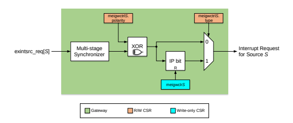
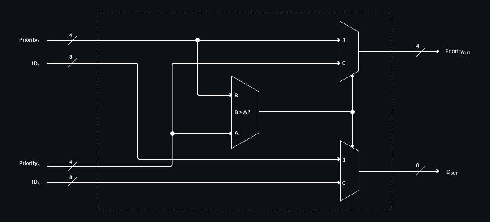
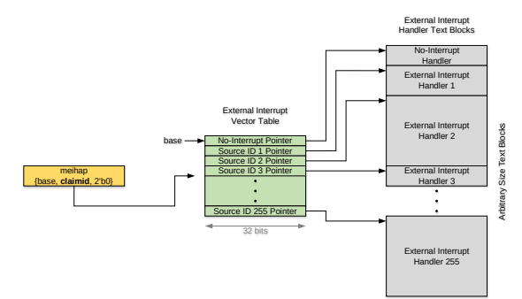

# 6 External Interrupts

See *Chapter 7, Platform-Level Interrupt Controller (PLIC)* in [2 (PLIC)] for general information.

:::{note}
Even though this specification is modeled to a large extent after the RISC-V PLIC (Platform-Level Interrupt Controller) specification, this interrupt controller is associated with the core, not the platform.
Therefore, the more general term PIC (Programmable Interrupt Controller) is used.
:::

## 6.1 Features

The PIC provides these core-level external interrupt features:

* Up to 255 global (core-external) interrupt sources (from 1 (highest) to 255 (lowest)) with separate enable control for each source
* 15 priority levels (numbered 1 (lowest) to 15 (highest)), separately programmable for each interrupt source
* Programmable reverse priority order (14 (lowest) to 0 (highest))
* Programmable priority threshold to disable lower-priority interrupts
* Wake-up priority threshold (hardwired to highest priority level) to wake up core from power-saving (Sleep) mode if interrupts are enabled
* One interrupt target (RISC-V hart M-mode context)
* Support for vectored external interrupts
* Support for fast interrupt redirection in hardware (selectable by build argument)
* Support for interrupt chaining and nested interrupts
* Power reduction feature for disabled external interrupts

## 6.2 Naming Convention 6.2.1 Unit, Signal, And Register Naming

**S suffix:** Unit, signal, and register names which have an S suffix indicate an entity specific to an interrupt source.

**X suffix:** Register names which have an X suffix indicate a consolidated register for multiple interrupt sources.

### 6.2.2 Address Map Naming

**Control/status register:** A control/status register mapped to either the memory or the CSR address space.

**Memory-mapped register:** Register which is mapped to RISC-V's 32-bit memory address space.

**Register in CSR address space:** Register which is mapped to RISC-V's 12-bit CSR address space.

## 6.3 Overview Of Major Functional Units 6.3.1 External Interrupt Source

All functional units on the chip which generate interrupts to be handled by the RISC-V core are referred to as external interrupt sources.
External interrupt sources indicate an interrupt request by sending an asynchronous signal to the PIC.

### 6.3.2 Gateway

Each external interrupt source connects to a dedicated gateway.
The gateway is responsible for synchronizing the interrupt request to the core's clock domain, and for converting the request signal to a common interrupt request format (i.e., active-high and level-triggered) for the PIC.
The PIC core can only handle one single interrupt request per interrupt source at a time.

All current SoC IP interrupts are asynchronous and level-triggered.
Therefore, the gateway's only function for SoC IP interrupts is to synchronize the request to the core clock domain.
There is no state kept in the gateway.

A gateway suitable for ASIC-external interrupts must provide programmability for interrupt type (i.e., edge- vs. leveltriggered) as well as interrupt signal polarity (i.e., low-to-high vs. high-to-low transition for edge-triggered interrupts, active-high vs. -low for level-triggered interrupts).
For edge-triggered interrupts, the gateway must latch the interrupt request in an interrupt pending (IP) flop to convert the edge- to a level-triggered interrupt signal.
Firmware must clear the IP flop while handling the interrupt.

:::{note}
While an interrupt is disabled, spurious changes of the interrupt source input may be captured in the IP flop.
To reduce the probability of reporting spurious interrupts, firmware should clear the IP flop before reenabling interrupts.
:::

:::{note}
The gateway does not implement any edge-detection logic (e.g., an edge-triggered flop) to convert the interrupt request to a level-triggered interrupt signal (see Figure 6-3).
Therefore, the interrupt request input signal must be set to the inactive level (i.e., to '0' for an active-high interrupt and to '1' for an active-low interrupt) to avoid an interrupt request being continuously reported as pending, even after the gateway's IP latch has been cleared.
Consequently, if the gateway of an unused interrupt request input is programmed to an "active-high" polarity, the interrupt input signal must be tied off to '0'.
Similarly, if the polarity is programmed to "active-low", the interrupt input signal must be tied off to '1'.
:::

:::{note}
For asynchronous interrupt sources, the pulse duration of an interrupt request must be at least two full clock cycles of the receiving (i.e., PIC core) clock domain to guarantee it will be recognized as an interrupt request.
Shorter pulses might be dropped by the synchronizer circuit.
:::

### 6.3.3 PIC Core

The PIC core's responsibility is to evaluate all pending and enabled interrupt requests and to pick the highest-priority request with the lowest interrupt source ID.
It then compares this priority with a programmable priority threshold and, to support nested interrupts, the priority of the interrupt handler if one is currently running.
If the picked request's priority is higher than both thresholds, it sends an interrupt notification to the core.
In addition, it compares the picked request's priority with the wake-up threshold (highest priority level) and sends a wake-up signal to the core, if the priorities match.
The PIC core also provides the interrupt source ID of the picked request in a status register.

:::{note}
Different levels in the evaluation tree may be staged wherever necessary to meet timing, provided that all signals of a request (ID, priority, etc.) are equally staged.
:::

### 6.3.4 Interrupt Target

The interrupt target is a specific RISC-V hart context. For the VeeR EL2 core, the interrupt target is the M privilege mode of the hart.

## 6.4 Pic Block Diagram

Figure 6-1 depicts a high-level view of the PIC.
A simple gateway for asynchronous, level-triggered interrupt sources is shown in Figure 6-2, whereas Figure 6-3 depicts conceptually the internal functional blocks of a configurable gateway.
Figure 6-4 shows a single comparator which is the building block to form the evaluation tree logic in the PIC core.

:::{figure-md}


Figure 6-1 PIC Block Diagram
:::

:::{note}
For R/W control/status registers with double-borders in Figure 6-1, the outputs of the registers are conditionally bit-wise inverted, depending on the priority order set in the *priord* bit of the mpiccfg register. This is necessary to support the reverse priority order feature.
:::

:::{note}
The PIC logic always operates in regular priority order. When in reverse priority order mode, firmware reads and writes the control/status registers with reverse priority order values. The values written to and read from the control/status registers are inverted. Therefore, from the firmware's perspective, the PIC operates in reverse priority order.
:::

:::{figure-md}


Figure 6-2 Gateway for Asynchronous, Level-triggered Interrupt Sources
:::

:::{figure-md}


Figure 6-3 Conceptual Block Diagram of a Configurable Gateway
:::

:::{figure-md}


Figure 6-4 Comparator
:::

## 6.5 Theory Of Operation

:::{note}
Interrupts must be disabled (i.e., the *mie* bit in the standard RISC-V mstatus register must be cleared) before changing the standard RISC-V mtvec register or the PIC's meicurpl and meipt registers, or unexpected behavior may occur.
:::

### 6.5.1 Initialization

The control registers must be initialized in the following sequence:

1. Configure the priority order by writing the *priord* bit of the mpiccfg register.
2. For each configurable gateway S, set the polarity (*polarity* field) and type (*type* field) in the meigwctrlS register and clear the IP bit by writing to the gateway's meigwclrS register.
3. Set the base address of the external vectored interrupt address table by writing the *base* field of the meivt register.
4. Set the priority level for each external interrupt source S by writing the corresponding *priority* field of the meiplS registers.
5. Set the priority threshold by writing *prithresh* field of the meipt register. 6. Initialize the nesting priority thresholds by writing '0' (or '15' for reversed priority order) to the *clidpri* field of the meicidpl and the *currpri* field of the meicurpl registers.
6. Enable interrupts for the appropriate external interrupt sources by setting the *inten* bit of the meieS registers for each interrupt source S.

### 6.5.2 Regular Operation

A step-by-step description of interrupt control and delivery:

1. The external interrupt source S signals an interrupt request to its gateway by activating the corresponding exintsrc_req[S] signal.
2. The gateway synchronizes the interrupt request from the asynchronous interrupt source's clock domain to the PIC core clock domain (pic_clk).
3. For edge-triggered interrupts, the gateway also converts the request to a level-triggered interrupt signal by setting its internal interrupt pending (IP) bit.
4. The gateway then signals the level-triggered request to the PIC core by asserting its interrupt request signal.
5. The pending interrupt is visible to firmware by reading the corresponding intpend bit of the meipX register.
6. With the pending interrupt, the source's interrupt priority (indicated by the priority field of the meiplS register) is forwarded to the evaluation logic.
7. If the corresponding interrupt enable (i.e., inten bit of the meieS register is set), the pending interrupt's priority is sent to the input of the first-level 2-input comparator.
8. The priorities of a pair of interrupt sources are compared:
    1. If the two priorities are different, the higher priority and its associated hardwired interrupt source ID are forwarded to the second-level comparator.
    1. If the two priorities are the same, the priority and the lower hardwired interrupt source ID are forwarded to the second-level comparator.
9. Each subsequent level of comparators compares the priorities from two comparator outputs of the previous level:
    1. If the two priorities are different, the higher priority and its associated interrupt source ID are forwarded to the next-level comparator.
    1. If the two priorities are the same, the priority and the lower interrupt source ID are forwarded to the next-level comparator.
10. The output of the last-level comparator indicates the highest priority (maximum priority) and lowest interrupt source ID (interrupt ID) of all currently pending and enabled interrupts.
11. Maximum priority is compared to the higher of the two priority thresholds (i.e., prithresh field of the meipt and currpri field of the meicurpl registers):
    1. If maximum priority is higher than the two priority thresholds, the mexintirq signal is asserted.
    1. If maximum priority is the same as or lower than the two priority thresholds, the mexintirq signal is deasserted.
12. The mexintirq signal's state is then reflected in the meip bit of the RISC-V hart's mip register.
13. In addition, maximum priority is compared to the wake-up priority level:
    1. If maximum priority is 15 (or 0 for reversed priority order), the wake-up notification (WUN) bit is set.
    1. If maximum priority is lower than 15 (or 0 for reversed priority order), the wake-up notification (WUN) bit is not set.
14. The WUN state is indicated to the target hart with the mhwakeup signal35.
15. When the target hart takes the external interrupt, it disables all interrupts (i.e., clears the mie bit of the RISCV hart's mstatus register) and jumps to the external interrupt handler.
16. The external interrupt handler writes to the meicpct register to trigger the capture of the interrupt source ID of the currently highest-priority pending external interrupt (in the meihap register) and its corresponding priority (in the meicidpl register). Note that the captured content of the claimid field of the meihap register and its corresponding priority in the meicidpl register is neither affected by the priority thresholds (prithresh field of the meipt and currpri field of the meicurpl registers) nor by the core's external interrupt enable bit (meie bit of the RISC-V hart's mie register).
17. The handler then reads the meihap register to obtain the interrupt source ID provided in the claimid field. Based on the content of the meihap register, the external interrupt handler jumps to the handler specific to this external interrupt source.
18. The source-specific interrupt handler services the external interrupt, and then:
    1. For level-triggered interrupt sources, the interrupt handler clears the state in the SoC IP which initiated the interrupt request.
    1. For edge-triggered interrupt sources, the interrupt handler clears the IP bit in the source's gateway by writing to the meigwclrS register.
19. The clearing deasserts the source's interrupt request to the PIC core and stops this external interrupt source from participating in the highest priority evaluation.
20. In the background, the PIC core continuously evaluates the next pending interrupt with highest priority and lowest interrupt source ID:
    1. If there are other interrupts pending, enabled, and with a priority level higher than prithresh field of the meipt and currpri field of the meicurpl registers, mexintirq stays asserted.
    1. If there are no further interrupts pending, enabled, and with a priority level higher than prithresh field of the meipt and currpri field of the meicurpl registers, mexintirq is deasserted.
21. Firmware may update the content of the meihap and meicidpl registers by writing to the meicpct register to trigger a new capture.

## 6.6 Support For Vectored External Interrupts

:::{note}
The RISC-V standard defines support for vectored interrupts down to an interrupt class level (i.e., timer, software, and external interrupts for each privilege level), but not to the granularity of individual external interrupt sources (as described in this section).
The two mechanisms are independent of each other and should be used together for lowest interrupt latency.
For more information on the standard RISC-V vectored interrupt support, see Section 3.1.7 in [2].
:::

The VeeR EL2 PIC implementation provides support for vectored external interrupts.
The content of the meihap register is a full 32-bit pointer to the specific vector to the handler of the external interrupt source which needs service.
This pointer consists of a 22-bit base address (*base*) of the external interrupt vector table, the 8-bit claim ID (*claimid*), and a 2-bit '0' field.
The *claimid* field is adjusted with 2 bits of zeros to construct the offset into the vector table containing 32-bit vectors.
The external interrupt vector table resides either in the DCCM, SoC memory, or a dedicated flop array in the core.

:::{figure-md}


Figure 6-5 Vectored External Interrupts
:::

Figure 6-5 depicts the steps from taking the external interrupt to starting to execute the interrupt source-specific handler. When the core takes an external interrupt, the initiated external interrupt handler executes the following operations:

1. Save register(s) used in this handler on the stack
2. Store to the meicpct control/status register to capture a consistent claim ID / priority level pair
3. Load the meihap control/status register into *regX*
4. Load memory location at address in *regX* into *regY*
5. Jump to address in *regY* (i.e., start executing the interrupt source-specific handler)

:::{note}
Two registers (*regX* and *regY*) are shown above for clarification only. The same register can be used.
:::

:::{note}
The interrupt source-specific handler must restore the register(s) saved in step 1. above before executing the mret instruction.
:::

It is possible in some corner cases that the captured claim ID read from the meihap register is 0 (i.e., no interrupt request is pending).
To keep the interrupt latency at a minimum, the external interrupt handler above should not check for this condition.
Instead, the pointer stored at the base address of the external interrupt vector table (i.e., pointer 0) must point to a 'no-interrupt' handler, as shown in Figure 6-5 above.
That handler can be as simple as executing a return from interrupt (i.e., mret) instruction.

Note that it is possible for multiple interrupt sources to share the same interrupt handler by populating their respective interrupt vector table entries with the same pointer to that handler.

### 6.6.1 Fast Interrupt Redirect

VeeR EL2 provides fast interrupt handing through interrupt redirection by hardware.
The fast interrupt redirect feature is configured with a build argument to the core.

If this feature is instantiated, hardware automatically captures a consistent claim ID / priority level pair once at least one qualifying external interrupt is pending and external interrupts are enabled (i.e., the *meie* bit in the mie register and the *mie* bit in the mstatus register are set).
Following conceptually the same flow as shown in Figure 6-5, hardware uses the content of the meihap register to lookup the start address of the corresponding Interrupt Service Routine (ISR) by stalling decode and creating a bubble in the LSU pipeline.
This bubble allows the core to access the external interrupt vector table in the DCCM to get the start address of the interrupt source-specific ISR.
Once the start address of the ISR is known, hardware creates an interrupt flush and redirects directly to the corresponding ISR.
If the hardware lookup of the ISR's start address fails for any reason, a non-maskable interrupt (NMI, see Section 2.16) is taken.
The reason for the lookup failure is reported in the mcause register (see Table 11-3) so firmware may determine which error condition has occurred.

The fast-interrupt-redirect-related NMI failure modes are:

* Double-bit uncorrectable ECC error on access (mcause value: 0xF000_1000)
* Access not entirely contained within the DCCM, but within DCCM region (mcause value: 0xF000_1001)
* Access to non-DCCM region (mcause value: 0xF000_1002)

:::{note}
The fast interrupt redirect mechanism is independent of the standard RISC-V direct and vectored interrupt modes.
However, when fast interrupt redirect is enabled, external interrupts are bypassing the standard RISC-V interrupt mechanism.
All other interrupts are still following the standard flow.
:::

:::{note}
The fast interrupt redirect feature is not compatible with interrupt chaining concept described in Section 6.7 below.
The meicpct register (see Section 6.12.8) to capture the latest interrupt evaluation result is not present if the fast interrupt redirect mechanism is instantiated because the capturing of the claim ID / priority level pair is initiated in hardware, instead of firmware.
:::

## 6.7 Interrupt Chaining

Figure 6-6 depicts the concept of chaining interrupts.
The goal of chaining is to reduce the overhead of pushing and popping state to and from the stack while handling a series of Interrupt Service Routines (ISR) of the same priority level.
The first ISR of the chain saves the state common to all interrupt handlers of this priority level to the stack and then services its interrupt.
If this handler needs to save additional state, it does so immediately after saving the common state and then restores only the additional state when done.
At the end of the handler routine, the ISR writes to the meicpct register to capture the latest interrupt evaluation result, then reads the meihap register to determine if any other interrupts of the same priority level are pending.

If no, it restores the state from the stack and exits.
If yes, it immediately jumps into the next interrupt handler skipping the restoring of state in the finished handler as well as the saving of the same state in the next handler.
The chaining continues until no other ISRs of the same priority level are pending, at which time the last ISR of the chain restores the original state from the stack again.

:::{note}
Interrupt chaining is not compatible with the fast interrupt redirect feature (see Section 6.6.1).
If the fast interrupt redirect mechanism is instantiated, interrupt chaining cannot be used.
:::

:::{figure-md}


Figure 6-6 Concept of Interrupt Chaining
:::

## 6.8 Interrupt Nesting

Support for multiple levels of nested interrupts helps to provide a more deterministic interrupt latency at higher priority levels.
To achieve this, a running interrupt handler with lower priority must be preemptable by a higher-priority interrupt.
The state of the preempted handler is saved before the higher priority interrupt is executed, so that it can continue its execution at the point it was interrupted.

VeeR EL2 and its PIC provide supported for up to 15 nested interrupts, one interrupt handler at each priority level.

The conceptual steps of nesting are:

1. The external interrupt is taken as described in step 15. of Section 6.5.2 *Regular Operation*. When the core takes the external interrupt, it automatically disables all interrupts.
2. The external interrupt handler executes the following steps to get into the source-specific interrupt handler, as described in Section 6.6:
   ```
   st meicpct // atomically captures winning claim ID and priority level
   ld meihap // get pointer to interrupt handler starting address
   ld isr_addr // load interrupt handler starting address
   jmp isr_addr // jump to source-specific interrupt handler
   ```
3. The source-specific interrupt handler then saves the state of the code it interrupted (including the priority level in case it was an interrupt handler) to the stack, sets the priority threshold to its own priority, and then reenables interrupts:
   ```
   push mepc, mstatus, mie, …
   push meicurpl // save interrupted code's priority level
   ld meicidpl // read interrupt handler's priority level
   st meicurpl // change threshold to handler's priority
   mstatus.mei=1 // reenable interrupts
   ```
4. Any external interrupt with a higher priority can now safely preempt the currently executing interrupt handler.
5. Once the interrupt handler finished its task, it disables any interrupts and restores the state of the code it interrupted:
   ```
   mstatus.mei=0 // disable all interrupts
   pop meicurpl // get interrupted code's priority level
   st meicurpl // set threshold to previous priority
   pop mepc, mstatus, mie, …
   mret // return from interrupt, reenable interrupts
   ```
6. The interrupted code continues to execute.

## 6.9 Power Reduction

The synchronizer and interrupt capture flops in the gateway of each external interrupt source are clocked every clock cycle even if the external interrupt request input signal is not changing.
These few flops cumulatively may consume a noticeable amount of the overall power of the VeeR EL2 core.
VeeR EL2 implements a clock gating feature which turns off the clock to the synchronizer and interrupt capture flops for disabled external interrupt to reduce power consumption.
However, the overhead to clock gate the flops associated with a single external interrupt source is significant enough that the potential power savings would be considerably reduced.

Therefore, to maximize the power reduction, the gateways of four external interrupt sources are clock gated together as a group (i.e., external interrupt sources 1..3 (since 0 is not a valid interrupt source), 4..7, 8..11, and so on).

If at least one external interrupt of a group is enabled, the synchronizer and interrupt capture flops of all four gateways in that group are clocked every clock cycle.
But if all four external interrupts of a group are disabled, the synchronizer and interrupt capture flops of all four gateways in that group are clock gated.

However, this change in functionality of the PIC has a software-visible impact.
The current status of pending external interrupt requests which are disabled may no longer be visible in the meipX registers (see Section 6.12.3).

Depending on the interrupt servicing method, this may be of no consequence.
However, for example, reliably polling the interrupt status of disabled interrupts periodically is no longer possible.

The *picio* bit of the mcgc register (see Table 10-2) controls this power saving feature. Setting the *picio* control bit to '0' turns this feature on.

Note that the default value of this clock gating feature is off (i.e., the *picio* bit is '1').
If the current status of pending external interrupt requests must be continuously reported in the meipX registers even for external interrupts which are disabled, this feature must remain turned off.

## 6.10 Performance Targets

The target latency through the PIC, including the clock domain crossing latency incurred by the gateway, is 4 core clock cycles.

## 6.11 Configurability

Typical implementations require fewer than 255 external interrupt sources.
Code should only be generated for functionality needed by the implementation.

### 6.11.1 Rules
* The IDs of external interrupt sources must start at 1 and be contiguous.
* All unused register bits must be hardwired to '0'.

### 6.11.2 Build Arguments

The PIC build arguments are:
* PIC base address for memory-mapped control/status registers (PIC_base_addr)
    * See Section 16.2.2
* Number of external interrupt sources
    * Total interrupt sources (RV_PIC_TOTAL_INT): 2..255


### 6.11.3 Impact on Generated Code

#### 6.11.3.1 External Interrupt Sources

The number of required external interrupt sources has an impact on the following:

* General impact:
    * Signal pins:
        * exintsrc_req[S]
    * Registers:
        * meiplS
        * meipX
    * Logic:
        * Gateway S
* Target PIC core impact:
    * Registers:
        * meieS
    * Logic:
        * Gating of priority level with interrupt enable
        * Number of first-level comparators
        * Unnecessary levels of the comparator tree

#### 6.11.3.2 Further Optimizations

Register fields, bus widths, and comparator MUXs are sized to cover the maximum external interrupt source IDs of 255.
For approximately every halving of the number of interrupt sources, it would be possible to reduce the number of register fields holding source IDs, bus widths carrying source IDs, and source ID MUXs in the comparators by one.
However, the overall reduction in logic is quite small, so it might not be worth the effort.


## 6.12 Pic Control/Status Registers

A summary of the PIC control/status registers in CSR address space:

* External Interrupt Priority Threshold Register (meipt) (see Section 6.12.5)
* External Interrupt Vector Table Register (meivt) (see Section 6.12.6)
* External Interrupt Handler Address Pointer Register (meihap) (see Section 6.12.7)
* External Interrupt Claim ID / Priority Level Capture Trigger Register (meicpct) (see Section 6.12.8) External Interrupt Claim ID's Priority Level Register (meicidpl) (see Section 6.12.9)
* External Interrupt Current Priority Level Register (meicurpl) (see Section 6.12.10)

A summary of the PIC memory-mapped control/status registers:

* PIC Configuration Register (mpiccfg) (see Section 6.12.1)
* External Interrupt Priority Level Registers (meiplS) (see Section 6.12.2)
* External Interrupt Pending Registers (meipX) (see Section 6.12.3)
* External Interrupt Enable Registers (meieS) (see Section 6.12.4)
* External Interrupt Gateway Configuration Registers (meigwctrlS) (see Section 6.12.11) - External Interrupt Gateway Clear Registers (meigwclrS) (see Section 6.12.12)

All reserved and unused bits in these control/status registers must be hardwired to '0'. Unless otherwise noted, all read/write control/status registers must have WARL (Write Any value, Read Legal value) behavior.

:::{note}
All memory-mapped register writes must be followed by a fence instruction to enforce ordering and synchronization.
:::

:::{note}
All memory-mapped control/status register accesses must be word-sized and word-aligned. Non-word sized/aligned loads cause a load access fault exception, and non-word sized/aligned stores cause a store/AMO access fault exception.
:::

:::{note}
Accessing unused addresses within the 32KB PIC address range do not trigger an unmapped address exception. Reads to unmapped addresses return 0, writes to unmapped addresses are silently dropped.
:::

### 6.12.1 Pic Configuration Register (Mpiccfg)

The PIC configuration register is used to select the operational parameters of the PIC.

This 32-bit register is an idempotent memory-mapped control register.

:::{table} Table 6-1 PIC Configuration Register (mpiccfg, at PIC_base_addr+0x3000)

| Field    | Bits   | Description                                                                                                                               | Access   | Reset   |
|----------|--------|-------------------------------------------------------------------------------------------------------------------------------------------|----------|---------|
| Reserved | 31:1   | Reserved                                                                                                                                  | R        | 0       |
| priord   | 0      | Priority order:  0: RISC-V standard compliant priority order (0=lowest to 15=highest)  1: Reverse priority order (15=lowest to 0=highest) | R/W      | 0       |

:::

### 6.12.2 External Interrupt Priority Level Registers (Meipls)

There are 255 priority level registers, one for each external interrupt source.
Implementing individual priority level registers allows a debugger to autonomously discover how many priority level bits are supported for this interrupt source.
Firmware must initialize the priority level for each used interrupt source.
Firmware may also read the priority level.

:::{note}
The read and write paths between the core and the meiplS registers must support direct and inverted accesses, depending on the priority order set in the *priord* bit of the mpiccfg register.
This is necessary to support the reverse priority order feature.
:::

These 32-bit registers are idempotent memory-mapped control registers.

:::{table} Table 6-2 External Interrupt Priority Level Register S=1..255 (meiplS, at PIC_base_addr+S*4)

| Field    | Bits   | Description                                                                                                                                                                                                                                                                                           | Access   | Reset   |
|----------|--------|-------------------------------------------------------------------------------------------------------------------------------------------------------------------------------------------------------------------------------------------------------------------------------------------------------|----------|---------|
| Reserved | 31:4   | Reserved                                                                                                                                                                                                                                                                                              | R        | 0       |
| priority | 3:0    | External interrupt priority level for interrupt source ID S:  RISC-V standard compliant priority order:  0: Never interrupt  1..15: Interrupt priority level (1 is lowest, 15 is highest)  Reverse priority order:  15: Never interrupt  14..0: Interrupt priority level (14 is lowest, 0 is highest) | R/W      | 0       |

:::

### 6.12.3 External Interrupt Pending Registers (Meipx)

Eight external interrupt pending registers are needed to report the current status of up to 255 independent external interrupt sources.
Each bit of these registers corresponds to an interrupt pending indication of a single external interrupt source.
These registers only provide the status of pending interrupts and cannot be written.

:::{note}
In VeeR EL2, by default, the status of disabled external interrupt requests are continuously reported in these registers.
To reduce power, the gateway's synchronizer and interrupt capture flops of disabled external interrupts may be gated (see Section 6.9).
However, if an up-to-date status of all pending interrupt requests is important, this clock gating feature controlled by the *picio* bit in the mcgc register (see Table 10-2) must remain off.
:::

These 32-bit registers are idempotent memory-mapped status registers.

:::{table} Table 6-3 External Interrupt Pending Register X=0..7 (meipX, at PIC_base_addr+0x1000+X*4)<br>`X = 0, Y = 1..31 and X = 1..7, Y = 0..31`

|Field|Bits|Description|Access|Reset|
|---|---|---|---|---|
|intpendX*32+Y|Y|External interrupt pending for interrupt source ID X*32+Y: 0: Interrupt not pending 1: Interrupt pending|R|0|
:::

:::{table} Table 6-3 (continued)<br>`X = 0, Y = 0`
|Field|Bits|Description|Access|Reset|
|---|---|---|---|---|
|Reserved|0|Reserved|R|0|
:::

### 6.12.4 External Interrupt Enable Registers (Meies)

Each of the up to 255 independently controlled external interrupt sources has a dedicated interrupt enable register.

Separate registers per interrupt source were chosen for ease-of-use and compatibility with existing controllers.

:::{note}
Not packing together interrupt enable bits as bit vectors results in context switching being a more expensive operation.
:::

These 32-bit registers are idempotent memory-mapped control registers.

:::{table} Table 6-4 External Interrupt Enable Register S=1..255 (meieS, at PIC_base_addr+0x2000+S*4)

| Field    | Bits   | Description                                                                                       | Access   | Reset   |
|----------|--------|---------------------------------------------------------------------------------------------------|----------|---------|
| Reserved | 31:1   | Reserved                                                                                          | R        | 0       |
| inten    | 0      | External interrupt enable for interrupt source ID S:  0: Interrupt disabled  1: Interrupt enabled | R/W      | 0       |

:::
### 6.12.5 External Interrupt Priority Threshold Register (Meipt)

The meipt register is used to set the interrupt target's priority threshold.
Interrupt notifications are sent to a target only for external interrupt sources with a priority level strictly higher than this target's threshold.
Hosting the threshold in a separate register allows a debugger to autonomously discover how many priority threshold level bits are supported.

:::{note}
The read and write paths between the core and the meipt register must support direct and inverted accesses, depending on the priority order set in the *priord* bit of the mpiccfg register.
This is necessary to support the reverse priority order feature.
:::

This 32-bit register is mapped to the non-standard read/write CSR address space.

:::{table} Table 6-5 External Interrupt Priority Threshold Register (meipt, at CSR 0xBC9)

| Field     | Bits   | Description                                                                                                                                                                                                                                                                                                                                                                                | Access   | Reset   |
|-----------|--------|--------------------------------------------------------------------------------------------------------------------------------------------------------------------------------------------------------------------------------------------------------------------------------------------------------------------------------------------------------------------------------------------|----------|---------|
| Reserved  | 31:4   | Reserved                                                                                                                                                                                                                                                                                                                                                                                   | R        | 0       |
| prithresh | 3:0    | External interrupt priority threshold:  RISC-V standard compliant priority order:  0: No interrupts masked  1..14: Mask interrupts with priority strictly lower than or equal to this  threshold  15: Mask all interrupts  Reverse priority order:  15: No interrupts masked  14..1: Mask interrupts with priority strictly lower than or equal to this  threshold  0: Mask all interrupts | R/W      | 0       |

:::
### 6.12.6 External Interrupt Vector Table Register (Meivt)

The meivt register is used to set the base address of the external vectored interrupt address table.
The value written to the *base* field of the meivt register appears in the *base* field of the meihap register.

This 32-bit register is mapped to the non-standard read-write CSR address space.

:::{table} Table 6-6 External Interrupt Vector Table Register (meivt, at CSR 0xBC8)

| Field    | Bits   | Description                                     | Access   | Reset   |
|----------|--------|-------------------------------------------------|----------|---------|
| base     | 31:10  | Base address of external interrupt vector table | R/W      | 0       |
| Reserved | 9:0    | Reserved                                        | R        | 0       |

:::
### 6.12.7 External Interrupt Handler Address Pointer Register (Meihap)

The meihap register provides a pointer into the vectored external interrupt table for the highest-priority pending external interrupt.
The winning claim ID is captured in the *claimid* field of the meihap register when firmware writes to the meicpct register to claim an external interrupt.
The priority level of the external interrupt source corresponding to the *claimid* field of this register is simultaneously captured in the *clidpri* field of the meicidpl register.
Since the PIC core is constantly evaluating the currently highest-priority pending interrupt, this mechanism provides a consistent snapshot of the highest-priority source requesting an interrupt and its associated priority level.

This is important to support nested interrupts.

The meihap register contains the full 32-bit address of the pointer to the starting address of the specific interrupt handler for this external interrupt source.
The external interrupt handler then loads the interrupt handler's starting address and jumps to that address.

Alternatively, the external interrupt source ID indicated by the *claimid* field of the meihap register may be used by the external interrupt handler to calculate the address of the interrupt handler specific to this external interrupt source.

:::{note}
The *base* field in the meihap register reflects the current value of the *base* field in the meivt register. I.e., *base* is not stored in the meihap register.
:::

This 32-bit register is mapped to the non-standard read-only CSR address space.

:::{table} Table 6-7 External Interrupt Handler Address Pointer Register (meihap, at CSR 0xFC8)

| Field   | Bits   | Description                                                                                                        | Access   | Reset   |
|---------|--------|--------------------------------------------------------------------------------------------------------------------|----------|---------|
| base    | 31:10  | Base address of external interrupt vector table (i.e., base field of meivt register)                               | R        | 0       |
| claimid | 9:2    | External interrupt source ID of highest-priority pending interrupt (i.e.,  lowest source ID with highest priority) | R        | 0       |
| 00      | 1:0    | Must read as '00'                                                                                                  | R        | 0       |

:::
### 6.12.8 External Interrupt Claim Id / Priority Level Capture Trigger Register (Meicpct)

The meicpct register is used to trigger the simultaneous capture of the currently highest-priority interrupt source ID (in the *claimid* field of the meihap register) and its corresponding priority level (in the *clidpri* field of the meicidpl register) by writing to this register.
Since the PIC core is constantly evaluating the currently highest-priority pending interrupt, this mechanism provides a consistent snapshot of the highest-priority source requesting an interrupt and its associated priority level.
This is important to support nested interrupts.

:::{note}
The meicpct register to capture the latest interrupt evaluation result is not present (i.e., an invalid CSR address) if the fast interrupt redirect mechanism (see Section 6.6.1) is instantiated.
With that feature, capturing the claim ID / priority level pair is initiated in hardware, instead of firmware.
:::

The meicpct register has WAR0 (Write Any value, Read 0) behavior. Writing '0' is recommended.

:::{note}
The meicpct register does not have any physical storage elements associated with it.
It is write-only and solely serves as the trigger to simultaneously capture the winning claim ID and corresponding priority level.
:::

This 32-bit register is mapped to the non-standard read/write CSR address space.

:::{table} Table 6-8 External Interrupt Claim ID / Priority Level Capture Trigger Register (meicpct, at CSR 0xBCA)

|Field|Bits|Description|Access|Reset|
|---|---|---|---|---|
|Reserved|31:0|Reserved|R0/WA|0|

:::
### 6.12.9 External Interrupt Claim Id'S Priority Level Register (Meicidpl)

The meicidpl register captures the priority level corresponding to the interrupt source indicated in the *claimid* field of the meihap register when firmware writes to the meicpct register.
Since the PIC core is constantly evaluating the currently highest-priority pending interrupt, this mechanism provides a consistent snapshot of the highest-priority source requesting an interrupt and its associated priority level.
This is important to support nested interrupts.

:::{note}
The read and write paths between the core and the meicidpl register must support direct and inverted accesses, depending on the priority order set in the *priord* bit of the mpiccfg register.
This is necessary to support the reverse priority order feature.
:::

This 32-bit register is mapped to the non-standard read/write CSR address space.

:::{table} Table 6-9 External Interrupt Claim ID’s Priority Level Register (meicidpl, at CSR 0xBCB)

|Field|Bits|Description|Access|Reset|
|---|---|---|---|---|
|Reserved|31:4|Reserved|R|0|
|clidpri|3:0|Priority level of preempting external interrupt source (corresponding to source ID read from claimid field of meihap register)|R/W|0|

:::
### 6.12.10 External Interrupt Current Priority Level Register (Meicurpl)

The meicurpl register is used to set the interrupt target's priority threshold for nested interrupts.
Interrupt notifications are signaled to the core only for external interrupt sources with a priority level strictly higher than the thresholds indicated in this register and the meipt register.

The meicurpl register is written by firmware, and not updated by hardware.
The interrupt handler should read its own priority level from the *clidpri* field of the meicidpl register and write it to the *currpri* field of the meicurpl register.
This avoids potentially being interrupted by another interrupt request with lower or equal priority once interrupts are reenabled.

:::{note}
 Providing the meicurpl register in addition to the meipt threshold register enables an interrupt service routine to temporarily set the priority level threshold to its own priority level. Therefore, only new interrupt requests with a strictly higher priority level are allowed to preempt the current handler, without modifying the longer-term threshold set by firmware in the meipt register.
:::

:::{note}
The read and write paths between the core and the meicurpl register must support direct and inverted accesses, depending on the priority order set in the *priord* bit of the mpiccfg register.
This is necessary to support the reverse priority order feature.
:::

This 32-bit register is mapped to the non-standard read/write CSR address space.

:::{table} Table 6-10 External Interrupt Current Priority Level Register (meicurpl, at CSR 0xBCC)

| Field    | Bits   | Description                                                               | Access   | Reset   |
|----------|--------|---------------------------------------------------------------------------|----------|---------|
| Reserved | 31:4   | Reserved                                                                  | R        | 0       |
| currpri  | 3:0    | Priority level of current interrupt service routine (managed by firmware) | R/W      | 0       |

:::

### 6.12.11 External Interrupt Gateway Configuration Registers (meigwctrlS)

Each configurable gateway has a dedicated configuration register to control the interrupt type (i.e., edge- vs. leveltriggered) as well as the interrupt signal polarity (i.e., low-to-high vs. high-to-low transition for edge-triggered interrupts, active-high vs. -low for level-triggered interrupts).

:::{note}
A register is only present for interrupt source S if a configurable gateway is instantiated.
:::

These 32-bit registers are idempotent memory-mapped control registers.

:::{table} Table 6-11 External Interrupt Gateway Configuration Register S=1..255 (meigwctrlS, at PIC_base_addr+0x4000+S*4)

| Field    | Bits   | Description                                                                                                   | Access   | Reset   |
|----------|--------|---------------------------------------------------------------------------------------------------------------|----------|---------|
| Reserved | 31:2   | Reserved                                                                                                      | R        | 0       |
| type     | 1      | External interrupt type for interrupt source ID S:  0: Level-triggered interrupt  1: Edge-triggered interrupt | R/W      | 0       |
| polarity | 0      | External interrupt polarity for interrupt source ID S:  0: Active-high interrupt  1: Active-low interrupt     | R/W      | 0       |

:::
### 6.12.12 External Interrupt Gateway Clear Registers (meigwclrS)

Each configurable gateway has a dedicated clear register to reset its interrupt pending (IP) bit.
For edge-triggered interrupts, firmware must clear the gateway's IP bit while servicing the external interrupt of source ID S by writing to the meigwclrS register.

:::{note}
A register is only present for interrupt source S if a configurable gateway is instantiated.
:::

The meigwclrS register has WAR0 (Write Any value, Read 0) behavior. Writing '0' is recommended.

:::{note}
The meigwclrS register does not have any physical storage elements associated with it.
It is write-only and solely serves as the trigger to clear the interrupt pending (IP) bit of the configurable gateway S.
:::

These 32-bit registers are idempotent memory-mapped control registers.

:::{table} Table 6-12 External Interrupt Gateway Clear Register *S=1..255* (meigwclrS, at PIC_base_addr+0x5000+S*4)

| Field    | Bits   | Description   | Access   | Reset   |
|----------|--------|---------------|----------|---------|
| Reserved | 31:0   | Reserved      | R0/WA    | 0       |

:::

## 6.13 Pic Csr Address Map

Table 6-13 summarizes the PIC non-standard RISC-V CSR address map.

:::{table} Table 6-13 PIC Non-standard RISC-V CSR Address Map

|Number|Privilege|Name|Description|Section|
|---|---|---|---|---|
|0xBC8|MRW|meivt|External interrupt vector table register|6.12.6|
|0xBC9|MRW|meipt|External interrupt priority threshold register|6.12.5|
|0xBCA|MRW|meicpct|External interrupt claim ID / priority level capture trigger register|6.12.8|
|0xBCB|MRW|meicidpl|External interrupt claim ID’s priority level register|6.12.9|
|0xBCC|MRW|meicurpl|External interrupt current priority level register|6.12.10|
|0xFC8|MRO|meihap|External interrupt handler address pointer register|6.12.7|

:::

## 6.14 Pic Memory-Mapped Register Address Map

:::{table} Table 6-14 summarizes the PIC memory-mapped register address map.

| Address Offset from PIC_base_addr / Start |Address Offset from PIC_base_addr / End   | Name                    | Description   | Section                             |
|-------------------------------------|-------------------------|---------------|-------------------------------------|--------|
| + 0x0000                            | + 0x0003                | Reserved      | Reserved                            |        |
| + 0x0004                            | + 0x0004 + Smax*4-1     | meiplS        | External interrupt priority level   register| 6.12.2 |
| + 0x0004 + Smax*4                   | + 0x0FFF                | Reserved      | Reserved                            |        |
| + 0x1000                            | + 0x1000 + (Xmax+1)*4-1 | meipX         | External interrupt pending register | 6.12.3 |
| + 0x1000 + (Xmax+1)*4               | + 0x1FFF                | Reserved      | Reserved                            |        |
| + 0x2000                            | + 0x2003                | Reserved      | Reserved                            |        |
| + 0x2004                            | + 0x2004 + Smax*4-1     | meieS         | External interrupt enable register  | 6.12.4 |
| + 0x2004 + Smax*4                   | + 0x2FFF                | Reserved      | Reserved                            |        |
| + 0x3000                            | + 0x3003            | mpiccfg       | External interrupt PIC configuration register                                                               | 6.12.1  |
| + 0x3004                            | + 0x3FFF            | Reserved      | Reserved                                                                             |         |
| + 0x4000                            | + 0x4003            | Reserved      | Reserved                                                                             |         |
| + 0x4004                            | + 0x4004 + Smax*4-1 | meigwctrlS    | External interrupt gateway  configuration register  (for configurable gateways only) | 6.12.11 |
| + 0x4004 + Smax*4                   | + 0x4FFF            | Reserved      | Reserved                                                                             |         |
| + 0x5000                            | + 0x5003            | Reserved      | Reserved                                                                             |         |
| + 0x5004                            | + 0x5004 + Smax*4-1 | meigwclrS     | External interrupt gateway clear  register  (for configurable gateways only)         | 6.12.12 |
| + 0x5004 + Smax*4                   | + 0x7FFF            | Reserved      | Reserved                                                                             |         |

:::

:::{note}
 Xmax = (Smax + 31) // 32, whereas // is an integer division ignoring the remainder
:::

## 6.15 Interrupt Enable/Disable Code Samples

### 6.15.1 Example Interrupt Flows

* Macro flow to enable interrupt source id 5 with priority set to 7, threshold set to 1, and gateway configured for edge-triggered/active-low interrupt source:
  ```
  disable_ext_int // Disable interrupts (MIE[meip]=0)
  set_threshold 1 // Program global threshold to 1
  init_gateway 5, 1, 1 // Configure gateway id=5 to edge-triggered/low
  clear_gateway 5 // Clear gateway id=5
  set_priority 5, 7 // Set id=5 threshold at 7
  enable_interrupt 5 // Enable id=5
  enable_ext_int // Enable interrupts (MIE[meip]=1)
  ```
* Macro flow to initialize priority order:
    * To RISC-V standard order:
      ```
      init_priorityorder 0 // Set priority to standard RISC-V order
      init_nstthresholds 0 // Initialize nesting thresholds to 0
      ```
    * To reverse priority order:
      ```
      init_priorityorder 1 // Set priority to reverse order
      init_nstthresholds 15 // Initialize nesting thresholds to 15
      ```
* Code to jump to the interrupt handler from the RISC-V trap vector:
  ```
  trap_vector: // Interrupt trap starts here when MTVEC[mode]=1
      csrwi meicpct, 1 // Capture winning claim id and priority
      csrr t0, meihap // Load pointer index
      lw t1, 0(t0) // Load vector address
      jr t1 // Go there
  ```

* Code to handle the interrupt:
  ```
  eint_handler:
   : // Do some useful interrupt handling
   mret // Return from ISR
  ```

### 6.15.2 Example Interrupt Macros

* Disable external interrupt:
  ```
   .macro disable_ext_int
       // Clear MIE[miep]
   disable_ext_int_\@:
       li a0, (1<<11)
       csrrc zero, mie, a0
  .endm
  ```
* Enable external interrupt:
  ```
  .macro enable_ext_int
  enable_ext_int_\@:
      // Set MIE[miep]
      li a0, (1<<11)
      csrrs zero, mie, a0
  .endm
  ```
* Initialize external interrupt priority order:
  ```
  .macro init_priorityorder priord
  init_priorityorder_\@:
      li tp, (RV_PIC_BASE_ADDR + RV_PIC_MPICCFG_OFFSET)
      li t0, \priord
      sw t0, 0(tp)
  .endm
  ```
* Initialize external interrupt nesting priority thresholds:
  ```
  .macro init_nstthresholds threshold
  init_nstthresholds_\@:
       li t0, \threshold li tp, (RV_PIC_BASE_ADDR + RV_PIC_MEICIDPL_OFFSET)
       sw t0, 0(tp)
       li tp, (RV_PIC_BASE_ADDR + RV_PIC_MEICURPL_OFFSET)
       sw t0, 0(tp)
  .endm
  ```
* Set external interrupt priority threshold:
  ```
  .macro set_threshold threshold
  set_threshold_\@:
        li tp, (RV_PIC_BASE_ADDR + RV_PIC_MEIPT_OFFSET)
        li t0, \threshold
        sw t0, 0(tp)
  .endm
  ```
* Enable interrupt for source id:
  ```
  .macro enable_interrupt id
  enable_interrupt_\@:
      li tp, (RV_PIC_BASE_ADDR + RV_PIC_MEIE_OFFSET + (\id <<2))
      li t0, 1
      sw t0, 0(tp)
  .endm
  ```
* Set priority of source id:
  ```
  .macro set_priority id, priority
  set_priority_\@:
      li tp, (RV_PIC_BASE_ADDR + RV_PIC_MEIPL_OFFSET + (\id <<2))
      li t0, \priority
      sw t0, 0(tp)
  .endm
  ```
* Initialize gateway of source id:
  ```
  .macro init_gateway id, polarity, type
  init_gateway_\@:
      li tp, (RV_PIC_BASE_ADDR + RV_PIC_MEIGWCTRL_OFFSET + (\id <<2))
      li t0, ((\type<<1) | \polarity)
      sw t0, 0(tp)
  .endm
  ```
* Clear gateway of source id:
  ```
  .macro clear_gateway id
  clear_gateway_\@:
      li tp, (RV_PIC_BASE_ADDR + RV_PIC_MEIGWCLR_OFFSET + (\id <<2))
      sw zero, 0(tp)
  .endm
  ```
