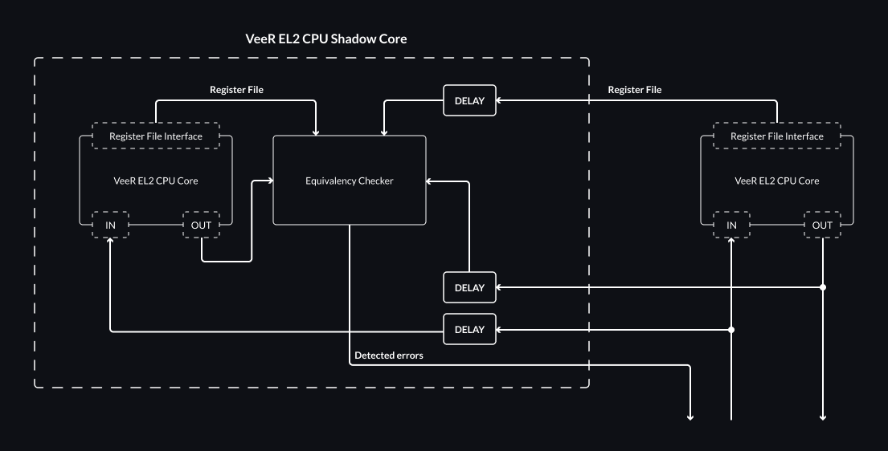

# Dual-Core Lockstep (DCLS)

This chapter describes the proposed Dual-Core Lockstep functionality and its future implementation in the VeeR EL2 Core, as required by Caliptra 2.0 for side-channel mitigation scenarios, although it may be useful for other applications like rad-hardening or other safety related-scenarios which DCLS is often also used for.

## VeeR EL2 DCLS Overview

The lockstep feature will be added as an optional feature of VeeR EL2, disabled by default.
If enabled, another copy of the VeeR EL2 CPU core will be additionally instantiated in the design.
This second core will be referred to as a Shadow Core in this chapter.

The Shadow Core is delayed by a constant, configurable `DELAY` number of clock cycles with regards to the main core.

The `DCCM` and `ICCM` memories are not duplicated, and only the main VeeR EL2 CPU core has access to them.
The Shadow Core is only supplied with the delayed inputs of the main core, including the relevant `DCCM` and `ICCM` data, without any ability to read from or write to those memories by itself.

Similarly, `Icache` is not duplicated with only the main VeeR EL2 CPU core having direct access.
The Shadow Core will receive a delayed copy of main core's `Icache` inputs.
The copy of main core's `Icache` outputs will be passed into the `Equivalency Checker` to be validated against the Shadow Core's `Icache` outputs.

Both cores operate on separate register files.

The Shadow Core's register file can be monitored via the exposed `Register File Interface`.

The diagram below outlines the architecture of the proposed solution.



Outputs and the register file from the main core are delayed by `DELAY` cycles and passed to the `Equivalency Checker` for verification against the outputs and the register file of the Shadow Core.

If the `Equivalency Checker` detects a mismatch between the cores, the logic will assert a panic signal.

It is up to the integrator to provide the error handling for the corruption detection.

[Monitored registers](#monitored-registers) are exposed for comparison purposes from the [el2_dec_tlu_ctl](https://github.com/chipsalliance/Cores-VeeR-EL2/blob/795eb588e34b6815033b769d54fcf7cfac4aae3a/design/dec/el2_dec_tlu_ctl.sv) and [el2_dec_gpr_ctl](https://github.com/chipsalliance/Cores-VeeR-EL2/blob/795eb588e34b6815033b769d54fcf7cfac4aae3a/design/dec/el2_dec_gpr_ctl.sv) modules through the [el2_dec](https://github.com/chipsalliance/Cores-VeeR-EL2/blob/795eb588e34b6815033b769d54fcf7cfac4aae3a/design/dec/el2_dec.sv) instantiated in [el2_veer](https://github.com/chipsalliance/Cores-VeeR-EL2/blob/795eb588e34b6815033b769d54fcf7cfac4aae3a/design/el2_veer.sv#L924) module.

### Error Policy

Depending on the application and its security requirements, one of the following error policies can be configured:

* Detected error will be reported using the detection bit and the cores' execution flow will proceed.
* Detected error will trigger an interrupt and halt the execution until the interrupt is handled.
* Detected error will escalate the problem to the external controller and await the reset of the system.

It is up to the integrator to choose the error policy and provide a handler logic (e.g. external reset block).

### Monitored Registers

To determine whether a discrepancy has occurred, the outputs from both cores will be compared taking into account a reasonable subset of the VeeR EL2 registers, as defined in the table below:

:::{list-table} Monitored VeeR EL2 Registers
:header-rows: 0
:name: tab-dcls-monitored-veer-el2-registers
:align: center

* - **Name**
  - **Description**
* - x1 (ra)
  - Return address
* - x2 (sp)
  - Stack pointer
* - x8 (s0/fp)
  - Saved register / frame pointer
* - x10-x11 (a0-a1)
  - Function arguments / return values
* - x12-17 (a2-7)
  - Function arguments
* - pc
  - Program Counter
* - npc
  - Next Program Counter
* - mstatus
  - Machine status
* - [mie](adaptations.md#machine-interrupt-enable-mie-and-machine-interrupt-pending-mip-registers)
  - Machine interrupt enable
* - mtvec
  - Machine trap-handler base address
* - mscratch
  - Scratch register for machine trap handlers
* - mepc
  - Machine exception program counter
* - [mcause](adaptations.md#machine-cause-register-mcause)
  - Machine trap cause
* - mtval
  - Machine bad address or instruction
* - [mip](adaptations.md#machine-interrupt-enable-mie-and-machine-interrupt-pending-mip-registers)
  - Machine interrupt pending
* - [mcycle](performance.md#standard-risc-v-registers)
  - Machine cycle counter
* - [minstret](performance.md#standard-risc-v-registers)
  - Machine instructions-retired counter
* - [mrac](memory-map.md#region-access-control-register-mrac)
  - Region access control
:::

```{note}
Should the monitored registers be dependent on the VeeR configuration?
```

## Configuration

```{warning}
The DCLS feature is not supported in Debug Mode.
Entering Debug Mode with DCLS enabled will disable DCLS until the next reset.
```

The DCLS feature can be enabled via: `--set=dcls_enable` option.

The delay can be specified with `--set=dcls_delay = { 2, 3, 4 }`, with the delay between 2 and 4 cycles.

```{note}
The range of allowed delays can be discussed in detail and adjusted later.
```

## Validation Plan

The DCLS feature will be tested within:

* Software DCLS [smoke test](https://github.com/chipsalliance/Cores-VeeR-EL2/tree/main/testbench/tests/dcls/dcls.c) - covers VeeR CPU core with the Shadow Core execution flow.
* RTL `el2_veer_lockstep` [module tests](https://github.com/chipsalliance/Cores-VeeR-EL2/tree/main/verification/block/dcls) - covers the Shadow Core by itself.

:::{list-table} Validation Plan
:name: vp-block-name-list-table
:header-rows: 0
:align: center

* - **Function**
  - **VeeR EL2 CPU core input corruption detection**
* - Reference Document
  -
* - Check description
  - Verify the panic signal is raised only upon core states' mismatch. Introduce corruption via VeeR EL2 CPU core inputs directed to the Shadow Core.
* - Coverage groups
  - Each output of the VeeR EL2 CPU Core is reached when detecting the mismatch by `Equivalence Checker`. All bounds of configurable delay are reached.
* - Assertions
  - Detection bit is asserted upon encountered corruption. Error behavior follows the error handling policy. No action is taken if no corruption was introduced.
* - Comments
  -
* - Test Name
  -
* -
  -
* - **Function**
  - **VeeR EL2 CPU core output corruption detection**
* - Reference Document
  -
* - Check description
  - Verify the panic signal is raised only upon core states' mismatch. Introduce corruption via the outputs of the main VeeR CPU core directed to `Equivalence Checker` in the Shadow Core.
* - Coverage groups
  - Each output of the VeeR EL2 CPU Core is reached when detecting the mismatch by `Equivalence Checker`. All bounds of configurable delay are reached.
* - Assertions
  - Detection bit is asserted upon encountered corruption. Error behavior follows the relevant error handling policy. No action is taken if no corruption was introduced.
* - Comments
  -
* - Test Name
  -
* -
  -
* - **Function**
  - **Internal state corruption detection**
* - Reference Document
  -
* - Check description
  - Verify the panic signal is raised only upon core states' mismatch. Introduce corruption via exposed registers of the Shadow Core.
* - Coverage groups
  - Each [monitored register](#monitored-registers) is detected by the `Equivalence Checker`. All bounds of configurable delay are reached.
* - Assertions
  - Detection bit is asserted upon encountered corruption. Error behavior follows the relevant error handling policy. No action is taken if no corruption was introduced.
* - Comments
  - The default path will likely be more easily testable with the help of the software testbench. It should be possible to simulate a fault injection via mailbox see: [top_tb.sv](https://github.com/chipsalliance/Cores-VeeR-EL2/blob/795eb588e34b6815033b769d54fcf7cfac4aae3a/testbench/tb_top.sv#L727).
* - Test Name
  -
* -
  -
* - **Function**
  - **DCLS default execution**
* - Reference Document
  -
* - Check description
  - Verify the DCLS feature behavior during non-obstructed execution.
* - Coverage groups
  -
* - Assertions
  - Detection bit is not raised. Detection interrupt is not asserted. The test provides the same results as the VeeR EL2 CPU core without the DCLS feature enabled.
* - Comments
  - It might be beneficial to use a software test with a program that will produce a result that can by easily compared to an alternative flow and also engage the VeeR EL2 core. Consider matrix multiplication.
* - Test Name
  -
* -
  -
* - **Function**
  - **Error reporting**
* - Reference Document
  -
* - Check description
  - Verify error reporting policy upon detected corruption.
* - Coverage groups
  - Each error policy is covered.
* - Assertions
  -
* - Comments
  -
* - Test Name
  -
* -
  -
* - **Function**
  - **Reset**
* - Reference Document
  -
* - Check description
  - Verify the behavior in reset. Ensure normal execution upon leaving reset.
* - Coverage groups
  -
* - Assertions
  - Shadow Core enters reset at the same time the main VeeR core does. Shadow Core exits reset after a predefined delay following the main core. Detected corruption and interrupts are deasserted upon entering the reset.
* - Comments
  -
* - Test Name
  -
* -
  -
:::
