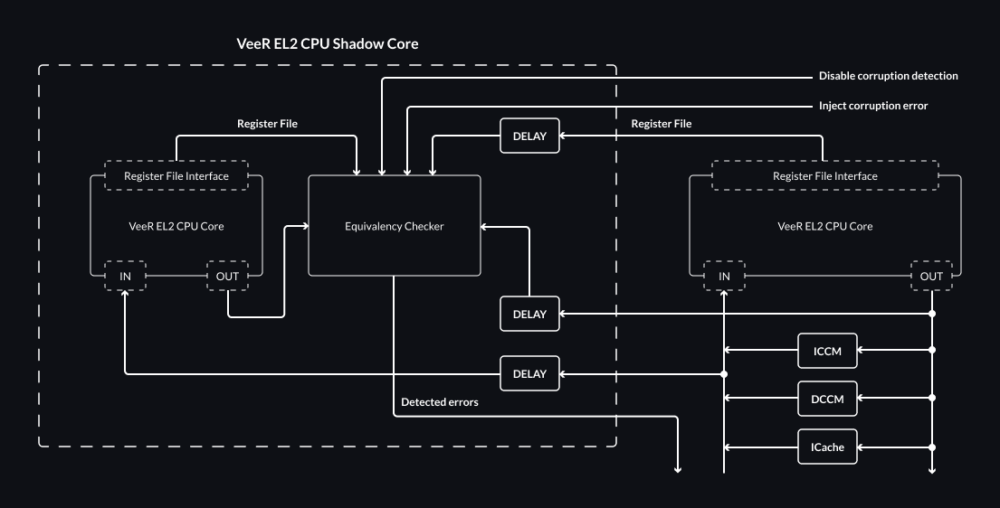

# Dual-Core Lockstep (DCLS)

This chapter describes the proposed Dual-Core Lockstep functionality and its future implementation in the VeeR EL2 Core, as required by Caliptra 2.0 for side-channel mitigation scenarios, although it may be useful for other applications like rad-hardening or other safety related-scenarios which DCLS is often also used for.

## VeeR EL2 DCLS Overview

The lockstep feature will be added as an optional feature of VeeR EL2, disabled by default.
If enabled, another copy of the VeeR EL2 CPU core will be additionally instantiated in the design.
This second core will be referred to as a Shadow Core in this chapter.

The Shadow Core is delayed by a constant, configurable `DELAY` number of clock cycles with regards to the main core.

The `DCCM` and `ICCM` memories are not duplicated, and only the main VeeR EL2 CPU core has access to them.
The Shadow Core is only supplied with the delayed inputs of the main core, including the relevant `DCCM` and `ICCM` data, without any ability to read from or write to those memories by itself.

Similarly, `Icache` is not duplicated with only the main VeeR EL2 CPU core having direct access.
The Shadow Core will receive a delayed copy of main core's `Icache` inputs.
The copy of main core's `Icache` outputs will be passed into the `Equivalency Checker` to be validated against the Shadow Core's `Icache` outputs.

The diagram below outlines the architecture of the proposed solution.



Outputs and the register file from the main core are delayed by `DELAY` cycles and passed to the `Equivalency Checker` for verification against the outputs and the register file of the Shadow Core.

### Error Policy

The Dual Core Lockstep module will report an error when detected by asserting a single bit output signal.
It is up to the integrator to provide a logic to handle the detected error.
The error can be artifficially injected by using [Shadow Core Control](#shadow-core-control) capabilities.
The corruption error will be reported always when all of the following requirements are met:
* Input and Output signals of both Main Core and Shadow Core differ OR an error injection feature is enabled,
* The Shadow Core is out of reset,
* The Shadow Core is not disabled.

### Monitored Registers

The Shadow Core can have its internal copy of the register file by setting a proper VeeR EL2 configuration flag.
Even though every discrepancy between register files of the Main Core and Shadow Core will eventually lead to difference between IOs of these modules, it might take some time for the mismatch to manifest.
To determine whether a discrepancy has occurred immediately, the register files from both cores will be compared taking into account a reasonable subset of the VeeR EL2 registers, as defined in the table below:

:::{list-table} Monitored VeeR EL2 Registers
:header-rows: 0
:name: tab-dcls-monitored-veer-el2-registers
:align: center

* - **Name**
  - **Description**
* - x1 (ra)
  - Return address
* - x2 (sp)
  - Stack pointer
* - x8 (s0/fp)
  - Saved register / frame pointer
* - x10-x11 (a0-a1)
  - Function arguments / return values
* - x12-17 (a2-7)
  - Function arguments
* - pc
  - Program Counter
* - npc
  - Next Program Counter
* - mstatus
  - Machine status
* - [mie](adaptations.md#machine-interrupt-enable-mie-and-machine-interrupt-pending-mip-registers)
  - Machine interrupt enable
* - mtvec
  - Machine trap-handler base address
* - mscratch
  - Scratch register for machine trap handlers
* - mepc
  - Machine exception program counter
* - [mcause](adaptations.md#machine-cause-register-mcause)
  - Machine trap cause
* - mtval
  - Machine bad address or instruction
* - [mip](adaptations.md#machine-interrupt-enable-mie-and-machine-interrupt-pending-mip-registers)
  - Machine interrupt pending
* - [mcycle](performance.md#standard-risc-v-registers)
  - Machine cycle counter
* - [minstret](performance.md#standard-risc-v-registers)
  - Machine instructions-retired counter
* - [mrac](memory-map.md#region-access-control-register-mrac)
  - Region access control
:::

```{note}
Should the monitored registers be dependent on the VeeR configuration?
```

### Monitored IOs

Since the Shadow Core module must replicate the behavior of the Main Core without any differences, it contains the same input and output ports.
Input ports are delayed and routed to the copy of the VeeR EL2 CPU, output ports are compared with the delayed output ports of the Main Core.
Refer to {ref}`tab-shadow-core-tracked-signals` for list of ports routed to the Shadow Core.

:::{list-table} Core Complex signals tracked by the Shadow Core
:name: tab-shadow-core-tracked-signals

* - **Signal**
  - **Dir**
  - **Description**
* - **Clock Enables**
  -
  -
* - ifu_bus_clk_en
  - in
  - IFU master system bus clock enable
* - lsu_bus_clk_en
  - in
  - LSU master system bus clock enable
* - dbg_bus_clk_en
  - in
  - Debug master system bus clock enable
* - dma_bus_clk_en
  - in
  - DMA slave system bus clock enable
* - **Reset**
  -
  -
* - rst_vec[31:1]
  - in
  - Core reset vector
* - **Interrupts**
  -
  -
* - nmi_int
  - in
  - Non-Maskable Interrupt (async)
* - nmi_vec[31:1]
  - in
  - Non-Maskable Interrupt vector
* - soft_int
  - in
  - Standard RISC-V software interrupt (async)
* - timer_int
  - in
  - Standard RISC-V timer interrupt (async)
* - extintsrc_req[pt.PIC_TOTAL_INT:1]
  - in
  - External interrupts (async)
* - **Core ID**
  -
  -
* - core_id[31:4]
  - in
  - Core ID (mapped to `mhartid[31:4]`)
* - **System Bus Interfaces**
  -
  -
* - ***AXI4***
  -
  -
* - ***Instruction Fetch Unit Master AXI4***
  -
  -
* - *Write address channel signals*
  -
  -
* - ifu_axi_awvalid
  - out
  - Write address valid (hardwired to 0)
* - ifu_axi_awready
  - in
  - Write address ready
* - ifu_axi_awid[pt.IFU_BUS_TAG-1:0]
  - out
  - Write address ID
* - ifu_axi_awaddr[31:0]
  - out
  - Write address
* - ifu_axi_awlen[7:0]
  - out
  - Burst length
* - ifu_axi_awsize[2:0]
  - out
  - Burst size
* - ifu_axi_awburst[1:0]
  - out
  - Burst type
* - ifu_axi_awlock
  - out
  - Lock type
* - ifu_axi_awcache[3:0]
  - out
  - Memory type
* - ifu_axi_awprot[2:0]
  - out
  - Protection type
* - ifu_axi_awqos[3:0]
  - out
  - Quality of Service (QoS)
* - ifu_axi_awregion[3:0]
  - out
  - Region identifier
* - *Write data channel signals*
  -
  -
* - ifu_axi_wvalid
  - out
  - Write valid (hardwired to 0)
* - ifu_axi_wready
  - in
  - Write ready
* - ifu_axi_wdata[63:0]
  - out
  - Write data
* - ifu_axi_wstrb[7:0]
  - out
  - Write strobes
* - ifu_axi_wlast
  - out
  - Write last
* - *Write response channel signals*
  -
  -
* - ifu_axi_bvalid
  - in
  - Write response valid
* - ifu_axi_bready
  - out
  - Write response ready (hardwired to 0)
* - ifu_axi_bid[pt.IFU_BUS_TAG-1:0]
  - in
  - Response ID tag
* - ifu_axi_bresp[1:0]
  - in
  - Write response
* - *Read address channel signals*
  -
  -
* - ifu_axi_arvalid
  - out
  - Read address valid
* - ifu_axi_arready
  - in
  - Read address ready
* - ifu_axi_arid[pt.IFU_BUS_TAG-1:0]
  - out
  - Read address ID
* - ifu_axi_araddr[31:0]
  - out
  - Read address
* - ifu_axi_arlen[7:0]
  - out
  - Burst length (hardwired to 0b0000_0000)
* - ifu_axi_arsize[2:0]
  - out
  - Burst size (hardwired to 0b011)
* - ifu_axi_arburst[1:0]
  - out
  - Burst type (hardwired to 0b01)
* - ifu_axi_arlock
  - out
  - Lock type (hardwired to 0)
* - ifu_axi_arcache[3:0]
  - out
  - Memory type (hardwired to 0b1111)
* - ifu_axi_arprot[2:0]
  - out
  - Protection type (hardwired to 0b100)
* - ifu_axi_arqos[3:0]
  - out
  - Quality of Service (QoS) (hardwired to 0b0000)
* - ifu_axi_arregion[3:0]
  - out
  - Region identifier
* - *Read data channel signals*
  -
  -
* - ifu_axi_rvalid
  - in
  - Read valid
* - ifu_axi_rready
  - out
  - Read ready
* - ifu_axi_rid[pt.IFU_BUS_TAG-1:0]
  - in
  - Read ID tag
* - ifu_axi_rdata[63:0]
  - in
  - Read data
* - ifu_axi_rresp[1:0]
  - in
  - Read response
* - ifu_axi_rlast
  - in
  - Read last
* - ***Load/Store Unit Master AXI4***
  -
  -
* - *Write address channel signals*
  -
  -
* - lsu_axi_awvalid
  - out
  - Write address valid
* - lsu_axi_awready
  - in
  - Write address ready
* - lsu_axi_awid[pt.LSU_BUS_TAG-1:0]
  - out
  - Write address ID
* - lsu_axi_awaddr[31:0]
  - out
  - Write address
* - lsu_axi_awlen[7:0]
  - out
  - Burst length (hardwired to 0b0000_0000)
* - lsu_axi_awsize[2:0]
  - out
  - Burst size
* - lsu_axi_awburst[1:0]
  - out
  - Burst type (hardwired to 0b01)
* - lsu_axi_awlock
  - out
  - Lock type (hardwired to 0)
* - lsu_axi_awcache[3:0]
  - out
  - Memory type
* - lsu_axi_awprot[2:0]
  - out
  - Protection type (hardwired to 0b000)
* - lsu_axi_awqos[3:0]
  - out
  - Quality of Service (QoS) (hardwired to 0b0000)
* - lsu_axi_awregion[3:0]
  - out
  - Region identifier
* - *Write data channel signals*
  -
  -
* - lsu_axi_wvalid
  - out
  - Write valid
* - lsu_axi_wready
  - in
  - Write ready
* - lsu_axi_wdata[63:0]
  - out
  - Write data
* - lsu_axi_wstrb[7:0]
  - out
  - Write strobes
* - lsu_axi_wlast
  - out
  - Write last
* - *Write response channel signals*
  -
  -
* - lsu_axi_bvalid
  - in
  - Write response valid
* - lsu_axi_bready
  - out
  - Write response ready
* - lsu_axi_bid[pt.LSU_BUS_TAG-1:0]
  - in
  - Response ID tag
* - lsu_axi_bresp[1:0]
  - in
  - Write response
* - *Read address channel signals*
  -
  -
* - lsu_axi_arvalid
  - out
  - Read address valid
* - lsu_axi_arready
  - in
  - Read address ready
* - lsu_axi_arid[pt.LSU_BUS_TAG-1:0]
  - out
  - Read address ID
* - lsu_axi_araddr[31:0]
  - out
  - Read address
* - lsu_axi_arlen[7:0]
  - out
  - Burst length (hardwired to 0b0000_0000)
* - lsu_axi_arsize[2:0]
  - out
  - Burst size
* - lsu_axi_arburst[1:0]
  - out
  - Burst type (hardwired to 0b01)
* - lsu_axi_arlock
  - out
  - Lock type (hardwired to 0)
* - lsu_axi_arcache[3:0]
  - out
  - Memory type
* - lsu_axi_arprot[2:0]
  - out
  - Protection type (hardwired to 0b000)
* - lsu_axi_arqos[3:0]
  - out
  - Quality of Service (QoS) (hardwired to 0b0000)
* - lsu_axi_arregion[3:0]
  - out
  - Region identifier
* - *Read data channel signals*
  -
  -
* - lsu_axi_rvalid
  - in
  - Read valid
* - lsu_axi_rready
  - out
  - Read ready
* - lsu_axi_rid[pt.LSU_BUS_TAG-1:0]
  - in
  - Read ID tag
* - lsu_axi_rdata[63:0]
  - in
  - Read data
* - lsu_axi_rresp[1:0]
  - in
  - Read response
* - lsu_axi_rlast
  - in
  - Read last
* - ***System Bus (Debug) Master AXI4***
  -
  -
* - *Write address channel signals*
  -
  -
* - sb_axi_awvalid
  - out
  - Write address valid
* - sb_axi_awready
  - in
  - Write address ready
* - sb_axi_awid[pt.SB_BUS_TAG-1:0]
  - out
  - Write address ID (hardwired to 0)
* - sb_axi_awaddr[31:0]
  - out
  - Write address
* - sb_axi_awlen[7:0]
  - out
  - Burst length (hardwired to 0b0000_0000)
* - sb_axi_awsize[2:0]
  - out
  - Burst size
* - sb_axi_awburst[1:0]
  - out
  - Burst type (hardwired to 0b01)
* - sb_axi_awlock
  - out
  - Lock type (hardwired to 0)
* - sb_axi_awcache[3:0]
  - out
  - Memory type (hardwired to 0b1111)
* - sb_axi_awprot[2:0]
  - out
  - Protection type (hardwired to 0b000)
* - sb_axi_awqos[3:0]
  - out
  - Quality of Service (QoS) (hardwired to 0b0000)
* - sb_axi_awregion[3:0]
  - out
  - Region identifier
* - *Write data channel signals*
  -
  -
* - sb_axi_wvalid
  - out
  - Write valid
* - sb_axi_wready
  - in
  - Write ready
* - sb_axi_wdata[63:0]
  - out
  - Write data
* - sb_axi_wstrb[7:0]
  - out
  - Write strobes
* - sb_axi_wlast
  - out
  - Write last
* - *Write response channel signals*
  -
  -
* - sb_axi_bvalid
  - in
  - Write response valid
* - sb_axi_bready
  - out
  - Write response ready
* - sb_axi_bid[pt.SB_BUS_TAG-1:0]
  - in
  - Response ID tag
* - sb_axi_bresp[1:0]
  - in
  - Write response
* - *Read address channel signals*
  -
  -
* - sb_axi_arvalid
  - out
  - Read address valid
* - sb_axi_arready
  - in
  - Read address ready
* - sb_axi_arid[pt.SB_BUS_TAG-1:0]
  - out
  - Read address ID (hardwired to 0)
* - sb_axi_araddr[31:0]
  - out
  - Read address
* - sb_axi_arlen[7:0]
  - out
  - Burst length (hardwired to 0b0000_0000)
* - sb_axi_arsize[2:0]
  - out
  - Burst size
* - sb_axi_arburst[1:0]
  - out
  - Burst type (hardwired to 0b01)
* - sb_axi_arlock
  - out
  - Lock type (hardwired to 0)
* - sb_axi_arcache[3:0]
  - out
  - Memory type (hardwired to 0b0000)
* - sb_axi_arprot[2:0]
  - out
  - Protection type (hardwired to 0b000)
* - sb_axi_arqos[3:0]
  - out
  - Quality of Service (QoS) (hardwired to 0b0000)
* - sb_axi_arregion[3:0]
  - out
  - Region identifier
* - *Read data channel signals*
  -
  -
* - sb_axi_rvalid
  - in
  - Read valid
* - sb_axi_rready
  - out
  - Read ready
* - sb_axi_rid[pt.SB_BUS_TAG-1:0]
  - in
  - Read ID tag
* - sb_axi_rdata[63:0]
  - in
  - Read data
* - sb_axi_rresp[1:0]
  - in
  - Read response
* - sb_axi_rlast
  - in
  - Read last
* - ***DMA Slave AXI4***
  -
  -
* - *Write address channel signals*
  -
  -
* - dma_axi_awvalid
  - in
  - Write address valid
* - dma_axi_awready
  - out
  - Write address ready
* - dma_axi_awid[pt.DMA_BUS_TAG-1:0]
  - in
  - Write address ID
* - dma_axi_awaddr[31:0]
  - in
  - Write address
* - dma_axi_awlen[7:0]
  - in
  - Burst length
* - dma_axi_awsize[2:0]
  - in
  - Burst size
* - dma_axi_awburst[1:0]
  - in
  - Burst type
* - dma_axi_awprot[2:0]
  - in
  - Protection type
* - *Write data channel signals*
  -
  -
* - dma_axi_wvalid
  - in
  - Write valid
* - dma_axi_wready
  - out
  - Write ready
* - dma_axi_wdata[63:0]
  - in
  - Write data
* - dma_axi_wstrb[7:0]
  - in
  - Write strobes
* - dma_axi_wlast
  - in
  - Write last
* - *Write response channel signals*
  -
  -
* - dma_axi_bvalid
  - out
  - Write response valid
* - dma_axi_bready
  - in
  - Write response ready
* - dma_axi_bid[pt.DMA_BUS_TAG-1:0]
  - out
  - Response ID tag
* - dma_axi_bresp[1:0]
  - out
  - Write response
* - *Read address channel signals*
  -
  -
* - dma_axi_arvalid
  - in
  - Read address valid
* - dma_axi_arready
  - out
  - Read address ready
* - dma_axi_arid[pt.DMA_BUS_TAG-1:0]
  - in
  - Read address ID
* - dma_axi_araddr[31:0]
  - in
  - Read address
* - dma_axi_arlen[7:0]
  - in
  - Burst length
* - dma_axi_arsize[2:0]
  - in
  - Burst size
* - dma_axi_arburst[1:0]
  - in
  - Burst type
* - dma_axi_arprot[2:0]
  - in
  - Protection type
* - *Read data channel signals*
  -
  -
* - dma_axi_rvalid
  - out
  - Read valid
* - dma_axi_rready
  - in
  - Read ready
* - dma_axi_rid[pt.DMA_BUS_TAG-1:0]
  - out
  - Read ID tag
* - dma_axi_rdata[63:0]
  - out
  - Read data
* - dma_axi_rresp[1:0]
  - out
  - Read response
* - dma_axi_rlast
  - out
  - Read last
* - ***AHB-Lite***
  -
  -
* - ***Instruction Fetch Unit Master AHB-Lite***
  -
  -
* - *Master signals*
  -
  -
* - haddr[31:0]
  - out
  - System address
* - hburst[2:0]
  - out
  - Burst type (hardwired to 0b000)
* - hmastlock
  - out
  - Locked transfer (hardwired to 0)
* - hprot[3:0]
  - out
  - Protection control
* - hsize[2:0]
  - out
  - Transfer size
* - htrans[1:0]
  - out
  - Transfer type
* - hwrite
  - out
  - Write transfer
* - *Slave signals*
  -
  -
* - hrdata[63:0]
  - in
  - Read data
* - hready
  - in
  - Transfer finished
* - hresp
  - in
  - Slave transfer response
* - ***Load/Store Unit Master AHB-Lite***
  -
  -
* - *Master signals*
  -
  -
* - lsu_haddr[31:0]
  - out
  - System address
* - lsu_hburst[2:0]
  - out
  - Burst type (hardwired to 0b000)
* - lsu_hmastlock
  - out
  - Locked transfer (hardwired to 0)
* - lsu_hprot[3:0]
  - out
  - Protection control
* - lsu_hsize[2:0]
  - out
  - Transfer size
* - lsu_htrans[1:0]
  - out
  - Transfer type
* - lsu_hwdata[63:0]
  - out
  - Write data
* - lsu_hwrite
  - out
  - Write transfer
* - *Slave signals*
  -
  -
* - lsu_hrdata[63:0]
  - in
  - Read data
* - lsu_hready
  - in
  - Transfer finished
* - lsu_hresp
  - in
  - Slave transfer response
* - ***System Bus (Debug) Master AHB-Lite***
  -
  -
* - *Master signals*
  -
  -
* - sb_haddr[31:0]
  - out
  - System address
* - sb_hburst[2:0]
  - out
  - Burst type (hardwired to 0b000)
* - sb_hmastlock
  - out
  - Locked transfer (hardwired to 0)
* - sb_hprot[3:0]
  - out
  - Protection control
* - sb_hsize[2:0]
  - out
  - Transfer size
* - sb_htrans[1:0]
  - out
  - Transfer type
* - sb_hwdata[63:0]
  - out
  - Write data
* - sb_hwrite
  - out
  - Write transfer
* - *Slave signals*
  -
  -
* - sb_hrdata[63:0]
  - in
  - Read data
* - sb_hready
  - in
  - Transfer finished
* - sb_hresp
  - in
  - Slave transfer response
* - ***DMA Slave AHB-Lite***
  -
  -
* - *Slave signals*
  -
  -
* - dma_haddr[31:0]
  - in
  - System address
* - dma_hburst[2:0]
  - in
  - Burst type
* - dma_hmastlock
  - in
  - Locked transfer
* - dma_hprot[3:0]
  - in
  - Protection control
* - dma_hsize[2:0]
  - in
  - Transfer size
* - dma_htrans[1:0]
  - in
  - Transfer type
* - dma_hwdata[63:0]
  - in
  - Write data
* - dma_hwrite
  - in
  - Write transfer
* - dma_hsel
  - in
  - Slave select
* - dma_hreadyin
  - in
  - Transfer finished in
* - *Master signals*
  -
  -
* - dma_hrdata[63:0]
  - out
  - Read data
* - dma_hreadyout
  - out
  - Transfer finished
* - dma_hresp
  - out
  - Slave transfer response
* - **Memory interfaces**
  -
  -
* - ***Data Close-Coupled Memory***
  -
  -
* - dccm_clk_override
  -
  -
* - dccm_ecc_double_error
  -
  -
* - dccm_ecc_single_error
  -
  -
* - dccm_rd_addr_hi
  -
  -
* - dccm_rd_addr_lo
  -
  -
* - dccm_rd_data_hi
  -
  -
* - dccm_rd_data_lo
  -
  -
* - dccm_rden
  -
  -
* - dccm_wr_addr_hi
  -
  -
* - dccm_wr_addr_lo
  -
  -
* - dccm_wr_data_hi
  -
  -
* - dccm_wr_data_lo
  -
  -
* - dccm_wren
  -
  -
* - dec_tlu_core_ecc_disable
  - out
  - Disable core ECC
* - ***Inctruction Close-Coupled Memory***
  -
  -
* - iccm_buf_correct_ecc
  -
  -
* - iccm_correction_state
  -
  -
* - iccm_ecc_double_error
  -
  -
* - iccm_ecc_single_error
  -
  -
* - iccm_rd_data
  -
  -
* - iccm_rd_data_ecc
  -
  -
* - iccm_rden
  -
  -
* - iccm_rw_addr
  -
  -
* - iccm_wr_data
  -
  -
* - iccm_wr_size
  -
  -
* - iccm_wren
  -
  -
* - icm_clk_override
  -
  -
* - ***Instruction Cache Memory***
  -
  -
* - ic_debug_addr
  -
  -
* - ic_debug_rd_data
  -
  -
* - ic_debug_rd_en
  -
  -
* - ic_debug_tag_array
  -
  -
* - ic_debug_way
  -
  -
* - ic_debug_wr_data
  -
  -
* - ic_debug_wr_en
  -
  -
* - ic_eccerr
  -
  -
* - ic_parerr
  -
  -
* - ic_premux_data
  -
  -
* - ic_rd_data
  -
  -
* - ic_rd_en
  -
  -
* - ic_rd_hit
  -
  -
* - ic_rw_addr
  -
  -
* - ic_sel_premux_data
  -
  -
* - ic_tag_perr
  -
  -
* - ic_tag_valid
  -
  -
* - ic_wr_data
  -
  -
* - ic_wr_en
  -
  -
* - ictag_debug_rd_data
  -
  -
* - **Power Management Unit (PMU) Interface**
  -
  -
* - i_cpu_halt_req
  - in
  - PMU halt request to core (async)
* - o_cpu_halt_ack
  - out
  - Core acknowledgement for PMU halt request
* - o_cpu_halt_status
  - out
  - Core halted indication
* - i_cpu_run_req
  - in
  - PMU run request to core (async)
* - o_cpu_run_ack
  - out
  - Core acknowledgement for PMU run request
* - **Multi-Processor Controller (MPC) Debug Interface**
  -
  -
* - mpc_debug_halt_req
  - in
  - MPC debug halt request to core (async)
* - mpc_debug_halt_ack
  - out
  - Core acknowledgement for MPC debug halt request
* - mpc_debug_run_req
  - in
  - MPC debug run request to core (async)
* - mpc_debug_run_ack
  - out
  - Core acknowledgement for MPC debug run request
* - mpc_reset_run_req
  - in
  - Core start state control out of reset
* - o_debug_mode_status
  - out
  - Core in Debug Mode indication
* - debug_brkpt_status
  - out
  - Hardware/software breakpoint indication
* - **Performance Counter Activity**
  -
  -
* - dec_tlu_perfcnt0
  - out
  - Performance counter 0 incrementing
* - dec_tlu_perfcnt1
  - out
  - Performance counter 1 incrementing
* - dec_tlu_perfcnt2
  - out
  - Performance counter 2 incrementing
* - dec_tlu_perfcnt3
  - out
  - Performance counter 3 incrementing
* - **Trace Port**
  -
  -
* - trace_rv_i_insn_ip[31:0]
  - out
  - Instruction opcode
* - trace_rv_i_address_ip[31:0]
  - out
  - Instruction address
* - trace_rv_i_valid_ip
  - out
  - Instruction trace valid
* - trace_rv_i_exception_ip
  - out
  - Exception
* - trace_rv_i_ecause_ip[4:0]
  - out
  - Exception cause
* - trace_rv_i_interrupt_ip
  - out
  - Interrupt exception
* - trace_rv_i_tval_ip[31:0]
  - out
  - Exception trap value
* - **Debug Module Interface**
  -
  -
* - dmi_reg_addr
  -
  -
* - dmi_reg_en
  -
  -
* - dmi_reg_rdata
  -
  -
* - dmi_reg_wdata
  -
  -
* - dmi_reg_wr_en
  -
  -
* - **Debug JTAG Port**
  -
  -
* - jtag_tck
  - in
  - JTAG Test Clock (async)
* - jtag_tms
  - in
  - JTAG Test Mode Select (async, sync to jtag_tck)
* - jtag_tdi
  - in
  - JTAG Test Data In (async, sync to jtag_tck)
* - jtag_trst_n
  - in
  - JTAG Test Reset (async)
* - jtag_tdo
  - out
  - JTAG Test Data Out (async, sync to jtag_tck)
* - jtag_id[31:1]
  - in
  - JTAG IDCODE register value (bit 0 tied internally to 1)
* - **Testing**
  -
  -
* - scan_mode
  - in
  - May be used to enable logic scan test, if implemented (must be ‘0’ for normal core operation)
* - mbist_mode
  - in
  - May be used to enable MBIST for core-internal memories, if implemented (should be tied to ‘0’ if not used)
:::

Signals not compared due to their special meaning:
* `clk` - [core complex clock](clocks.md#clocking),
* `free_l2clk` - core complex clock always enabled, routed through one clock header,
* `active_l2clk` - core complex clock enabled when the core is active, routed through one clock header,
* `rst_l` - [core complex reset](clocks.md#core-complex-reset-rst-l),
* `dbg_rst_l` - [debug module reset](clocks.md#debug-module-reset-dbg-rst-l).

## Shadow Core Control

The DCLS module exposes control logic that can be potentially connected to the external CSR.
Specific signals available as the module ports are described in the {ref}`tab-shadow-core-control-signals`.
The error injection logic is a part of the Shadow Core and its purpose is to test whether the lockstep module operates correctly and to disable it if needed.
Error is injected by asserting the `corruption_detected_o` output signal even if there is no corruption error detected between the Shadow Core and the Main Core.

:::{list-table} Shadow Core Control Signals
:name: tab-shadow-core-control-signals

* - **Signal**
  - **Direction**
  - **Width**
  - **Description**
* - disable_corruption_detection_i
  - input
  - 1
  - Disable all error injection features
* - lockstep_err_injection_en_i
  - input
  - 1
  - Activate an error injection to the Shadow Core
* - corruption_detected_o
  - output
  - 1
  - Indicate that a Shadow Core detected an error (corruption in comparison to the Main Core)
:::

## Configuration

```{warning}
The DCLS feature is not supported in Debug Mode.
Entering Debug Mode with DCLS enabled will disable DCLS until the next reset.
```

The DCLS feature can be enabled via `-set lockstep_enable=1` option.
There are two configuration options:
* `-set lockstep_delay={2, 3, 4}` - the delay applied on the Shadow Core between 2 and 4 cycles,
* `-set lockstep_regfile_enable=1` - enable exposing the VeeR Register File so the Shadow Core will have an internal copy to compare with the Main Core Register File.

The configuration options are ignored and their macros are not generated if the Dual Core Lockstep feature is disabled.

## Validation Plan

The DCLS feature will be tested within:

* Software DCLS [smoke test](https://github.com/chipsalliance/Cores-VeeR-EL2/tree/main/testbench/tests/dcls/dcls.c) - covers VeeR CPU core with the Shadow Core execution flow.
* RTL `el2_veer_lockstep` [module tests](https://github.com/chipsalliance/Cores-VeeR-EL2/tree/main/verification/block/dcls) - covers the Shadow Core by itself.

:::{list-table} Validation Plan
:name: vp-block-name-list-table
:header-rows: 0
:align: center

* - **Function**
  - **VeeR EL2 CPU core input corruption detection**
* - Reference Document
  -
* - Check description
  - Verify the panic signal is raised only upon core states' mismatch. Introduce corruption via VeeR EL2 CPU core inputs directed to the Shadow Core.
* - Coverage groups
  - Each output of the VeeR EL2 CPU Core is reached when detecting the mismatch by `Equivalence Checker`. All bounds of configurable delay are reached.
* - Assertions
  - Detection bit is asserted upon encountered corruption. Error behavior follows the error handling policy. No action is taken if no corruption was introduced.
* - Comments
  -
* - Test Name
  -
* -
  -
* - **Function**
  - **VeeR EL2 CPU core output corruption detection**
* - Reference Document
  -
* - Check description
  - Verify the panic signal is raised only upon core states' mismatch. Introduce corruption via the outputs of the main VeeR CPU core directed to `Equivalence Checker` in the Shadow Core.
* - Coverage groups
  - Each output of the VeeR EL2 CPU Core is reached when detecting the mismatch by `Equivalence Checker`. All bounds of configurable delay are reached.
* - Assertions
  - Detection bit is asserted upon encountered corruption. Error behavior follows the relevant error handling policy. No action is taken if no corruption was introduced.
* - Comments
  -
* - Test Name
  -
* -
  -
* - **Function**
  - **Internal state corruption detection**
* - Reference Document
  -
* - Check description
  - Verify the panic signal is raised only upon core states' mismatch. Introduce corruption via exposed registers of the Shadow Core.
* - Coverage groups
  - Each [monitored register](#monitored-registers) is detected by the `Equivalence Checker`. All bounds of configurable delay are reached.
* - Assertions
  - Detection bit is asserted upon encountered corruption. Error behavior follows the relevant error handling policy. No action is taken if no corruption was introduced.
* - Comments
  - The default path will likely be more easily testable with the help of the software testbench. It should be possible to simulate a fault injection via mailbox see: [top_tb.sv](https://github.com/chipsalliance/Cores-VeeR-EL2/blob/795eb588e34b6815033b769d54fcf7cfac4aae3a/testbench/tb_top.sv#L727).
* - Test Name
  -
* -
  -
* - **Function**
  - **DCLS default execution**
* - Reference Document
  -
* - Check description
  - Verify the DCLS feature behavior during non-obstructed execution.
* - Coverage groups
  -
* - Assertions
  - Detection bit is not raised. Detection interrupt is not asserted. The test provides the same results as the VeeR EL2 CPU core without the DCLS feature enabled.
* - Comments
  - It might be beneficial to use a software test with a program that will produce a result that can by easily compared to an alternative flow and also engage the VeeR EL2 core. Consider matrix multiplication.
* - Test Name
  -
* -
  -
* - **Function**
  - **Error reporting**
* - Reference Document
  -
* - Check description
  - Verify error reporting policy upon detected corruption.
* - Coverage groups
  - Each error policy is covered.
* - Assertions
  -
* - Comments
  -
* - Test Name
  -
* -
  -
* - **Function**
  - **Reset**
* - Reference Document
  -
* - Check description
  - Verify the behavior in reset. Ensure normal execution upon leaving reset.
* - Coverage groups
  -
* - Assertions
  - Shadow Core enters reset at the same time the main VeeR core does. Shadow Core exits reset after a predefined delay following the main core. Detected corruption and interrupts are deasserted upon entering the reset.
* - Comments
  -
* - Test Name
  -
* -
  -
:::
