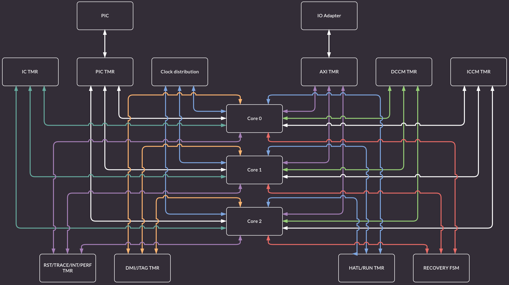
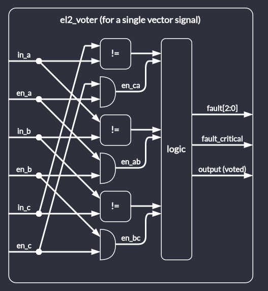
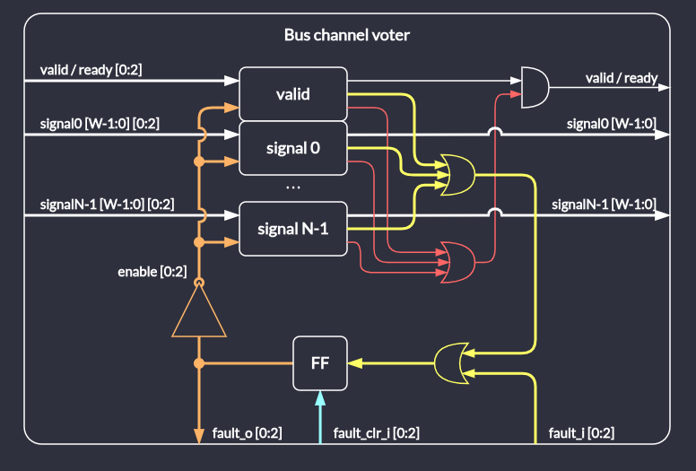
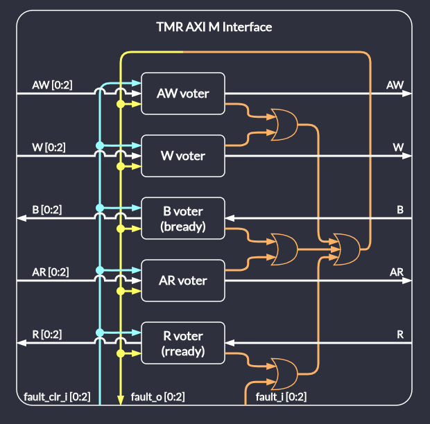
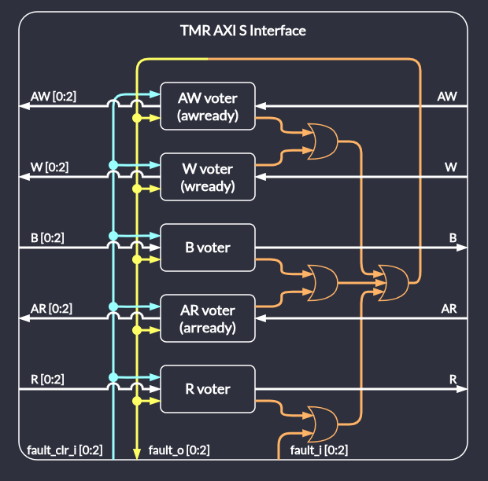
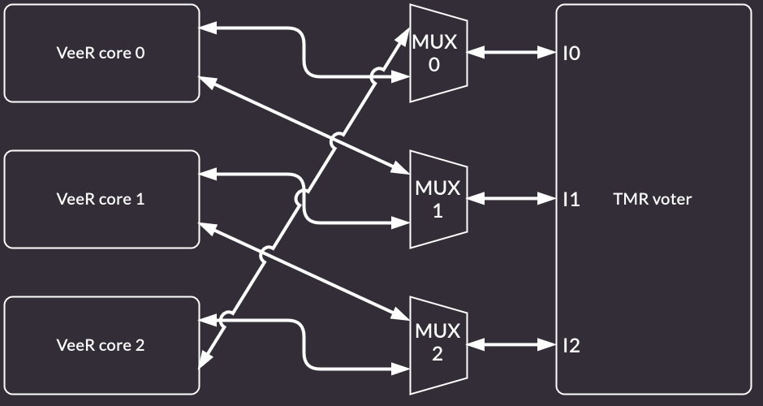

# Triple Modular Redundancy (TMR)

This chapter describes the TMR feature of VeeR EL2 core.
When enabled, the top-level module instantiates 3 independent but synchronized VeeR cores along with majority voting, error detection and recovery logic.

```{note}
The following documentation describes planned TMR architecture and implementation which is subject to changes.
Also, at the moment the complete TMR functionality isn't implemented yet.
```

## Configuration

To enable the TMR feature pass the following options to the `veer.config` script:
```
-set=triple_modular_redundancy_enable=1
```

```{note}
Triple Modular Redundancy and Dual Core Lockstep configurations are mutually exclusive
```

## Architecture

Triple Modular Redundancy complex is a super set of the regular VeeR EL2 core.

:::{figure-md}


Block diagram of the TMR complex
:::

The TMR complex contains:
* 3 VeeR EL2 cores without integrated PIC
* PIC common for all the cores in the complex
* PIC TMR - interface voter that handles PIC and external interrupt buses
* IC TMR - interface voter that handles Instruction Cache bus
* Clock distribution module - gates and distributes clocks to the TMR complex logic and to the VeeR EL2 cores
* IO Adapter - handles selection between AXI and AHB external buses, it is not hardened
* AXI TMR - interface voter that handles IFU, LSU, SB and DMA AXI buses
* DCCM TMR - interface voter that handles DCCM bus
* ICCM TMR - interface voter that handles ICCM bus
* MISC TMR - interface voter which handles reset propagation, trace interface, timer/soft/NMI interrupts
* DMI/JTAG TMR - interface voter that handles JTAG bus, it also multiplexes between normal debug JTAG and failed core debug JTAG
* HATL/RUN TMR - interface voter that handles MPC and PMU buses, it is also used during recovery process
* Recovery FSM - handles system recovery in the TMR mode

### Majority voting

Outgoing interface signals of the three VeeR cores are passes to majority voter modules.
The voter module implements majority voting for an N-bit signal value given three inputs.
The block diagram of the module is shown below:

:::{figure-md}


Block diagram of the voter module
:::

Each input has an associated enable input which is used to exclude a particular input from voting.
There is also a fault output associated with each input which is used to indicate which one disagrees with the other two.
In parallel to per-input fault status outputs, there is a critical fault output which is asserted when the true output signal state cannot be derived from active inputs.

Depending on the number of enabled inputs, the module implements the following functionalities:

 - 3 inputs enabled

   Majority voting with fault indication.

 - 2 inputs enabled

   Disagreemend detection without particular fault indication.

 - 1 input enabled

   Constant critical failure, unable to detect / correct a fault due to missing information.

### Majority voting for AXI bus interfaces

The TMR AXI interface is used to interface the triple core complex to the system bus.
In the design, there's one TMR AXI interface per VeeR AXI interface.
This includes:

 - IFU
 - LSU
 - DMA (external access to ICCM/DCCM)
 - SB (debugging side bus)

There are two types of the interface: for AXI manager and subordinate.

#### Bus channel voter

The block diagram below shows a generalized structure for a bus channel voter.
The same structure is used for all AXI manager and subordinate channels.

:::{figure-md}


Block diagram of TMR bus channel voter
:::

The module consists of separate majority voting modules for each multi-bit bus signal (and including `valid` or `ready`)

Critical (unrecoverable) faults detected by the voters are logically OR-ed together and used to gate the handshake signal.
This forms a fast combinational-only path that prevents spurious / faulty transactions from being issued / acknowledged by the TMR core complex.

Detected individual core faults are also OR-ed together and with an external fault input but instead of used for gating, they drive flip-flops that store their state.
Outputs of the flip-flops drive enable inputs of the voters.
Its the responsibility of each voter to indicate a critical failure if input state cannot be derived from all of its enabled inputs.
The outputs are also exposed to the outside of the module.

#### TMR AXI manager interface

The high-level block diagram of the interface is shown in the block diagram:
:::{figure-md}


Block diagram of TMR AXI manager interface
:::

The module consists of 5 AXI manager channel modules.
The structure of a channel module is specific to each channel but in general conforms to a bus channel voter.

In this module all fault outpus from all channel modules are OR-ed together and then connected to them back through external fault inputs.
This closes a loop around flip-fliops in bus voters making them immediately latch any fault, regardless of where it is reported.

There is no need to combinationaly gate each `valid`/`ready` handshake signal with aggregated critical fault detections from all channel modules.
This is beacause channel handshake is confined only to the channel.

#### TMR AXI subordinate interface

The high-level block diagram of the interface is shown in the block diagram:
:::{figure-md}


Block diagram of TMR AXI subordinate interface
:::

The module operates in the same way as the AXI manager interface.
All bus signals have reversed direction, voters differ as well as they operate only on signals driven by CPU cores.

#### AXI transaction completion

In case of a recoverable fault, an AXI transaction must be completed before the TMR complex can perform the recovery procedure.
For this purpose there are write and read AXI bus monitor modules.
Each of them is responsible for blocking recovery during pending transactions and blocking new transactions during pending recovery.
This prevents violating AXI bus protocol and allows the system to continue operation once recovery is done.

For unrecoverable (critical) faults, the AXI monitor module provides information whether the fault happened between or during a transaction.
In the former case, reset of only the TMR complex is required. In the latter, the whole system requires a reset.

### Majority voting for CCM and PIC interfaces

VeeR core uses three kinds of CCM (closely coupled memory):
 * ICCM
 * DCCM
 * I-Cache

There's also the PIC which is memory mapped and connected through a dedicated interface resembing one of a CCM block.

All of them are connected to the core via interfaces, where VeeR is the manager.

TMR adapters for these interfaces follows the same design pattern as single AXI channel interface.
Flow control signals are gated by critical fault detection combinational logic.

## Boot configuration

VeeR in the TMR configuration allows for 3 modes of operation:
* no redundancy single core
* 0-delay dual core lockstep
* triple modular redundancy

To allow for boot time configuration special multiplexer are added before TMR voters.
:::{figure-md}


Block diagram of TMR multiplexing
:::

These modes can only be configured while the VeeR complex is in the reset.
This is achieved using external multi bit signals:
* `activate_core_0`
* `activate_core_1`
* `activate_core_2`

This signals control which core(s) will be brought from reset and have active clock tree.
They are internally latched in the TMR registers, and refreshed each cycle after reset is released.
TMR is used to guarantee that configuration bits are more resilient to the radiation and interference.
Following table describes which core, mode and mux configuration is active based on the `activate_core_x` signals.

:::{list-table} Execution Mode
* - **activate_core_0**
  - **activate_core_1**
  - **activate_core_2**
  - **MUX 0 source**
  - **MUX 1 source**
  - **MUX 2 source**
  - **Operating Mode**
  - **Active Core(s)**
* - True
  - True
  - True
  - core 0
  - core 1
  - core 2
  - TMR
  - 0, 1, 2
* - True
  - True
  - False
  - core 0
  - core 1
  - core 2
  - 0-delay DCLS
  - 0, 1
* - True
  - False
  - True
  - core 0
  - core 1
  - core 2
  - 0-delay DCLS
  - 0, 2
* - False
  - True
  - True
  - core 0
  - core 1
  - core 2
  - 0-delay DCLS
  - 1, 2
* - True
  - False
  - False
  - core 0
  - core 0
  - core 2
  - Single core
  - 0
* - False
  - True
  - False
  - core 0
  - core 1
  - core 1
  - Single core
  - 1
* - False
  - False
  - True
  - core 2
  - core 1
  - core 2
  - Single core
  - 2
* - False
  - False
  - False
  - core 0
  - core 1
  - core 2
  - Invalid
  - None
:::

### TMR Configuration
In the TMR mode all cores are active.
TMR muxes are configured to pass interface directly from the adjacent core.
TMR voter is actively monitoring all cores comparing their values
It is capable of reporting single (non-fatal errors) and all-core disagreement (fatal error).
Recovery module is configured to perform its duty when CPU context allows for it.
System is in the highest redundancy mode.

### DCLS Configuration
In the DCLS mode 2 out of 3 cores are active.
TMR muxes are configured to pass interface directly from the adjacent core.
TMR voter input from the inactive core is marked as if it had previously failed TMR voting.
It is only capable of reporting all-core disagreement (fatal error).
Recovery module is configured to remain inactive and not respond to error signals.
System is in the downgraded redundancy mode, any failures will result in the fatal error being raised.

### Single Core Configuration
In the single core mode only 1 out of 3 cores is active.
TMR muxes are configured so that active core(i) is routed to I(i) and I((i + 1) % 3) TMR inputs.
Rest of the complex is configured the same way as in the DCLS mode.
System has no redundancy and failures will not be caught.
