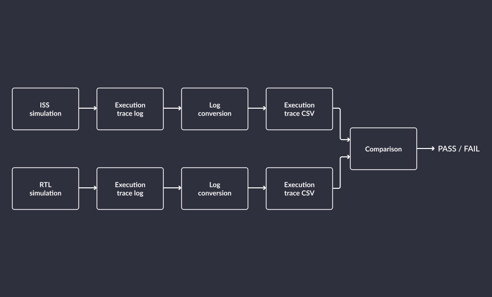

# Verification

This chapter documents verification of the VeeR EL2 Core and coverage data collection, including RTL-level tests designed to exercise parts of the core's logic, software execution tests, randomized code generator tests, as well as verification coverage.

Tests listed in this chapter are run in [Continuous Integration pipelines](https://github.com/chipsalliance/Cores-VeeR-EL2/tree/main/.github/workflows) of the [`cores-veer-el2` repository](https://github.com/chipsalliance/Cores-VeeR-EL2) via GitHub Actions.

## RTL-level tests

Verification of the VeeR EL2 Core includes an RTL test suite created to exercise details of the core's internal architecture.
These tests complement the software execution tests described in [later section of this chapter](#software-execution-tests).

RTL-level tests include block-level as well as top-level tests developed for the VeeR EL2 Core:
* Block-level tests are located in the [`verification/block` directory](https://github.com/chipsalliance/Cores-VeeR-EL2/tree/main/verification/block) of the [`cores-veer-el2` repository](https://github.com/chipsalliance/Cores-VeeR-EL2).
* Top-level tests are located in the [`verification/top` directory](https://github.com/chipsalliance/Cores-VeeR-EL2/tree/main/verification/top) of the [`cores-veer-el2` repository](https://github.com/chipsalliance/Cores-VeeR-EL2).

### Cocotb tests

The main group of RTL tests were implemented using [cocotb](https://www.cocotb.org/), a popular co-simulation testbench library for Python, allowing for re-use of the extensive Python testing ecosystem for design verification.

The test files are located in the [`verification/block/`](https://github.com/chipsalliance/Cores-VeeR-EL2/blob/main/verification/block/) directory of the [`Cores-VeeR-EL2 repository`](https://github.com/chipsalliance/Cores-VeeR-EL2/).

The verification environment is extended by a PyUVM (Universal Verification Methodology implemented in Python instead of SystemVerilog) test with a corresponding CI workflow.
It implements a basic PyUVM structure to test the core's behavior when interrupt pins are stimulated.

### UVM verification

UVM tests are run as the `Test-UVM` job in the CI pipelines of the [`cores-veer-el2` repository](https://github.com/chipsalliance/Cores-VeeR-EL2).
The test files are located in the [`testbench/uvm` directory](https://github.com/chipsalliance/Cores-VeeR-EL2/tree/main/testbench/uvm) of the [`cores-veer-el2` repository](https://github.com/chipsalliance/Cores-VeeR-EL2).

## Software execution tests

### Regression tests

Regression tests are run as the `Test-Regression` job in the CI pipelines of the [`cores-veer-el2` repository](https://github.com/chipsalliance/Cores-VeeR-EL2).

Regression testing involves execution of rudimentary software that was executed correctly on previous runs.
The regression test executes `.hex` files of the following pieces of software:

* A `hello_world` program
* A Dhrystone benchmark program
* A Coremark benchmark program

Regression tests include verification of privilege mode switching.
The test files are located in the [`testbench/tests/modesw` directory](https://github.com/chipsalliance/Cores-VeeR-EL2/tree/main/testbench/tests/modesw) of the [`cores-veer-el2` repository](https://github.com/chipsalliance/Cores-VeeR-EL2) and described in more detail in the [README file](https://github.com/chipsalliance/Cores-VeeR-EL2/blob/main/testbench/tests/modesw/README.md).

### Renode tests

[Renode](https://renode.io/) is a deterministic simulation framework used to verify proper software execution.
The tests are defined in the [`testbench/tests` directory](https://github.com/chipsalliance/Cores-VeeR-EL2/tree/main/testbench/tests) of the [`cores-veer-el2` repository](https://github.com/chipsalliance/Cores-VeeR-EL2).

Renode uses [Robot Framework](https://robotframework.org/), an open source automation framework for test automation and robotic process automation (RPA).
A testing script to execute test binaries is defined in the [`veer.robot` file](https://github.com/chipsalliance/Cores-VeeR-EL2/blob/main/tools/renode/veer.robot).

For detailed information regarding verification of the VeeR EL2 core with Renode, refer to the [VeeR EL2 Support in Renode README](https://github.com/chipsalliance/Cores-VeeR-EL2/blob/main/tools/renode/README.md).

### RISCOF Verification

[RISCOF](https://riscof.readthedocs.io/en/stable/index.html) is a RISC-V core test framework.
It uses [official architectural assembly test programs](https://github.com/riscv-non-isa/riscv-arch-test) where the core memory state is compared against a reference.
The comparison happens between the simulated core under test and a reference ISS, similar to [tests with RISCV-DV](#riscv-dv-verification) described below.

The RISCOF framework exercises the VeeR core with tests that use the Spike ISS and Verilator.
Like with RISCV-DV, a mismatch in memory signature comparison is reported as a CI failure.

The compared memory region is known as the memory signature.
Its boundaries are defined by special symbols defined in each test program.
It is the responsibility of the simulator / ISS to dump the memory signature for comparison by RISCOF.

For more detailed information about verification of the VeeR EL2 core with RISCOF, refer to the [README](https://github.com/chipsalliance/Cores-VeeR-EL2/tree/main/tools/riscof).

#### Adaptation of VeeR simulation and testbench to RISCOF

Adaptation of VeeR for RISCOF required implementing the memory signature dump.
Thanks to the use of Verilator it was possible to automatically load and parse the symbol map extracted from the binary ELF file and inject signature boundary addresses to the RTL simulation.
The simulation executable accepts the `--symbols` argument which specifies the symbol map file obtained using the `nm` utility.
The addresses can also be provided manually via the `--mem-signature` argument as two hexadecimal numbers.

The memory dump itself is implemented as a SystemVerilog task called from the RTL code right before the simulation ends.
The output file name is fixed to `veer.signature`.
The task automatically assures access to the correct memory - data is loaded from DCCM by default.
Otherwise, it is taken from the generic RAM present in the testbench.
When no signature range is defined, the dump is not written.

#### RISCOF model plugin

RISCOF uses Python plugins to interface with simulated cores and ISSs.
The task of a plugin is to build and link assembly test programs in a way suitable for core / ISS use and to run the simulation.
The plugin may also provide dedicated code snippets used by test programs to communicate with the simulation (eg. signal program end).
Currently plugins are available for the Spike ISS and the SAIL ISS.
Since every RTL simulation framework for a core is different, it requires a dedicated plugin.

The VeeR plugin, located in the [`/tools/riscof/veer`](https://github.com/chipsalliance/Cores-VeeR-EL2/tree/main/tools/riscof/veer) directory of this repository, performs the following tasks:

* Code compilation and linking
* Symbol dump (to get the memory signature address range)
* Simulation run
* Result collection (moving / renaming the output memory signature dump file)

The VeeR RTL needs to be "Verilated" upfront as the plugin assumes that the simulation binary is already present.

## RISCV-DV verification

[RISCV-DV](https://github.com/chipsalliance/riscv-dv) is a verification framework (originally from Google, now also in CHIPS Alliance) designed to test and (co-)verify RISC-V CPU cores.

RISCV-DV tests are run as the `Test-RISCV-DV` job in the CI pipelines of the [`cores-veer-el2` repository](https://github.com/chipsalliance/Cores-VeeR-EL2).

Pre-generated RISCV-DV test programs for fallback in case of failure in generation in CI pipelines are stored in the [`.github/assets/riscv-dv` directory](https://github.com/chipsalliance/Cores-VeeR-EL2/tree/main/.github/assets/riscv_dv).

The framework generates random instruction chains to exercise certain core features and relies on the [Universal Verification Methodology (UVM)](https://www.accellera.org/community/uvm) for code generation.
These instructions are then simultaneously executed by the core (RTL simulation) and by a reference RISC-V ISS (instruction set simulator), for example [Spike](https://github.com/riscv-software-src/riscv-isa-sim).
The core states of both are then compared and an error is reported in case of a mismatch.

RISCV-DV tests are run as the `Test-RISCV-DV` job in the CI pipelines of the [`cores-veer-el2` repository](https://github.com/chipsalliance/Cores-VeeR-EL2).
This job is responsible for running the RISCV-DV test suite on the VeeR core, downloading Renode and building the VeeR ISS.

A mismatch between an ISS trace and the RTL trace reported by RISCV-DV framework immediately triggers a CI error.

### RISCV-DV Test flow

The RISCV-DV test flow for the VeeR EL2 Core looks as follows:

* Generate a program using a `RISCV-DV` generator
* Run the program in a RISC-V ISS, collect the trace
* Run the program inside a simulation of the VeeR EL2 core using [Verilator](https://www.veripool.org/verilator/) and collect the trace
* Compare both execution trace files
* If no mismatches are found, the test is successful

{numref}`riscv-dv-flow` below illustrates this flow.

:::{figure-md} riscv-dv-flow


RISCV-DV flow
:::

For more detailed information about verification of the VeeR EL2 core with RISCV-DV, refer to the [README](https://github.com/chipsalliance/Cores-VeeR-EL2/tree/main/tools/riscv-dv).

In a physical design, external stimulus, e.g. from interrupt source or debugging requests, causes relevant CSRs to be updated automatically, which is not always the case for tests relying solely on generated streams of instructions.
In the future, tests to verify these features will be implemented using the [RISCV-DV handshaking mechanism](https://github.com/chipsalliance/riscv-dv/blob/master/docs/source/handshake.rst), a feature put in place specifically to update the core's internal state properly.

### Current implementation

Since RISCV-DV does not provide a generic way of simulating RISC-V cores at RTL level, this implementation runs the existing testbench for VeeR EL2 in Verilator.
RISCV-DV requires execution traces in its own standardized format, so we developed a Python script which parses the VeeR EL2 execution log and converts it to the [CSV format](https://htmlpreview.github.io/?https://github.com/google/riscv-dv/blob/master/docs/build/singlehtml/index.html#trace-csv-format) accepted by RISCV-DV.

The end-to-end flow is implemented by the Makefile in `tools/riscv-dv`.
The RISCV-DV `run.py` script is used for random code generation, compilation and ISS execution.
A set of Makefile rules implements building the verilated testbench, running it, converting trace logs and trace comparison.
The comparison itself is done by `instr_trace_compare.py` in RISCV-DV.

The flow currently supports three ISSs:

* [Spike](https://github.com/riscv-software-src/riscv-isa-sim)
* [VeeR-ISS (a.k.a. whisper)](https://github.com/chipsalliance/VeeR-ISS)
* [Renode](https://renode.io/)

The CI workflow for RISCV-DV builds or downloads the prerequisites (Verilator, Spike, VeeR-ISS, Renode) and invokes the test flow.
A failure of any of RISCV-DV tests is reported as CI failure.

### Renode integration

[Renode](https://renode.io/) is Antmicro's open source development framework which allows debugging and testing unmodified embedded software on your PC - from bare System-on-Chips, through complete devices, to multi-node systems.

As a part of the the project, we extended the RISCV-DV framework [with Renode ISS support](https://github.com/chipsalliance/riscv-dv/pull/935).
The work also included defining a virtual Renode platform for VeeR EL2, executing RISCV-DV pseudo-random programs on it and collecting execution trace logs.
Basic level VeeR EL2 support in Renode opens up the potential to simulate the Caliptra RoT as well as the RoT in the context of a larger SoC in conjunction with Renode's support for e.g. ARM and RISC-V cores and peripherals or OpenTitan peripherals (some of which are used in Caliptra)

## Verification coverage

For each of the tests described in this chapter, data is collected and processed to determine verification coverage.

### Coverage analysis

To verify whether all parts of a design have been tested, you can get coverage reports from simulation runs which inform about a percentage of possible design states that were simulated.
You can then use this information to prepare new testing scenarios that test previously untested design states.

Results for verification coverage of the entire design as well as its parts are available in the [VeeR EL2 coverage dashboard](https://chipsalliance.github.io/Cores-VeeR-EL2/html/main.html).
The results are updated with each Pull Request, as visible in the [Active pull request list](https://chipsalliance.github.io/Cores-VeeR-EL2/html/dev.html).
Data is only available for open Pull Requests and is removed once a Pull Request is closed or merged.

### Coverage analysis with open source tools

Verilator supports certain method of test [coverage analysis](https://veripool.org/guide/latest/simulating.html#coverage-analysis).
There are three ways in which Verilator collects coverage data:

* Line coverage

  Verilator automatically counts changes to the RTL code flow at all possible branch points.

* Toggle coverage

  Automatic toggle count for each signal. Does not apply to certain signal types as described in [Verilator's documentation](https://veripool.org/guide/latest/simulating.html#coverage-analysis).

* Functional coverage

  Verilator automatically counts events defined by the `cover property`, which are implemented in the source code.

To enable coverage collection with Verilator, simply add the following lines to the C++ testbench:

```
  // Write coverage data
#if VM_COVERAGE
  Verilated::threadContextp()->coveragep()->write("coverage.dat");
#endif
```
The `genhtml` utility from the `lcov` package is used to convert the data collected from the verification into `.html` files present it in the form of [the VeeR EL2 coverage dashboard](https://chipsalliance.github.io/Cores-VeeR-EL2/html/main/coverage_dashboard/all/index.html).

### Identification of signals without coverage

The recommended way to identify signals with low coverage is to use the annotation mechanism.
The annotation mechanism is provided by the [verilator_coverage](https://github.com/verilator/verilator/blob/master/bin/verilator_coverage) tool and is capable of writing source files with annotations next to each coverage point.

Coverage reports in the form of `.dat` files can be combined using the following command:

```
verilator_coverage coverage_test_*.dat --write combined.dat
```

In order to annotate the coverage results back to the source files, run the command:

```
verilator_coverage coverage_test.dat --annotate <output_dir>
```

```{note}
`annotate-all`, `annotate-min` and `annotate-points` can be used to modify the behavior of the `annotate` option.
For more details, see [Verilator Argument Reference](https://verilator.org/guide/latest/exe_verilator_coverage.html)
```

The result of the command should be a copy of the source files used in the simulation, located in the output directory of choice.
In the annotated source files, you will find that annotations are placed at the beginning of lines, e.g.:

```
   153724    input  logic en;
  %000000    input  logic scan_mode;
```

Interpretations of these results are placed inline:

```
   153724    input  logic en; // there were 153724 coverage hits
  %000000    input  logic scan_mode; // signal never toggled, so line starts with '%'
```

If a single line contains more than one signal definition (or a multi-bit signal), it may be useful to run with the `annotate-points` argument, so that the annotation resembles:

```
    153888    input logic SE, EN, CK,
    -000000  point: comment=SE
    +153888  point: comment=EN
    +2636790  point: comment=CK
```

In this mode, '+' and '-' are used to indicate whether a coverage point is above or below the threshold.

To read more about coverage in Verilator, see:
* [Coverage analysis](https://verilator.org/guide/latest/simulating.html#coverage-analysis)
* [verilator_coverage executable documentation](https://verilator.org/guide/latest/exe_verilator_coverage.html)
